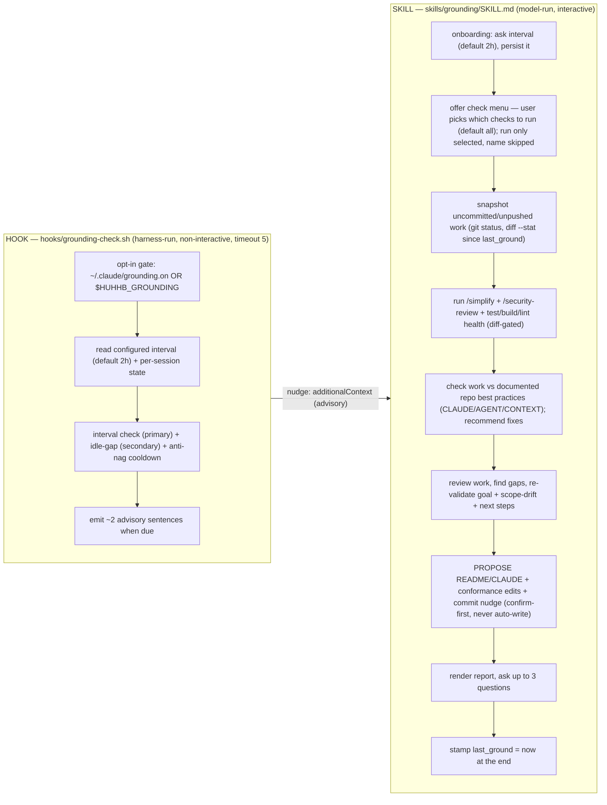
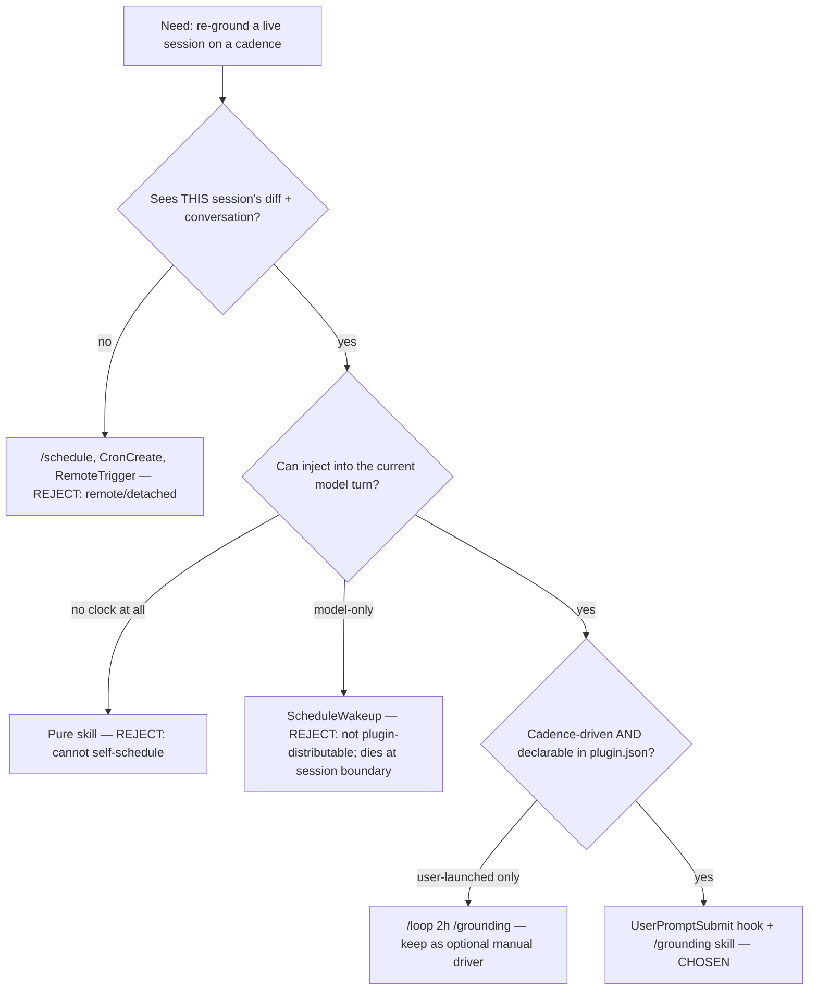
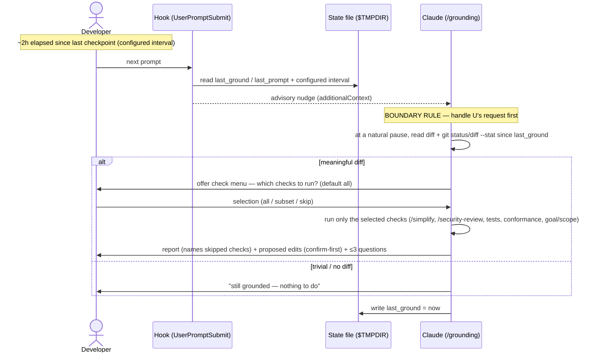

# Grounding Skill — Development Plan

> **Status:** plan for review (not yet implemented). Authored 2026-06-02 from a four-agent
> design pass (architecture · skill-writing · project-manager · software-developer) that
> assessed, cross-critiqued, and synthesized this plan, then audited against the live repo.
> Governed by the **writing-skills** TDD methodology (Iron Law: no skill without a failing test first).

## Purpose

Grounding exists to make it easier for the developer to:

1. **Keep track of their work** — surface uncommitted/unpushed changes and summarize what has happened
   since the last checkpoint.
2. **Keep code changes meaningful and designed to the repo's principles** — check the work against the
   repository's *documented* best practices (CLAUDE.md / AGENT.md / CONTEXT.md / CONTRIBUTING) and
   recommend conformance fixes.
3. **Improve code quality** — run `/simplify`, `/security-review`, and a test/build/lint health check
   on the changes.
4. **Keep alignment on goals/outcomes** — re-validate that the work still matches the session's stated
   objective, re-confirm next steps, and ask clarifying questions.

Every checkpoint is **propose-only** and best-effort (hooks nudge, they don't force); a no-op checkpoint
that honestly reports "still grounded" is a success. The four steps below map directly to these goals.

## Decisions locked (by the user)

| Fork | Decision | Consequence |
| --- | --- | --- |
| **Cadence** | **Interval-driven (configurable)** | Hook fires primarily when the configured interval has elapsed since the last checkpoint. The interval is **asked at onboarding** and persisted; it **defaults to 2 h (120 min)** when no input is given. Idle-gap (returning after a long delay) is kept as a *secondary* trigger. Override precedence: `HUHHB_GROUNDING_INTERVAL_MIN` env > persisted value > 120. |
| **Doc edits** | **Propose only** | Grounding **never** auto-writes `README`/`CLAUDE.md` or commits. Always a confirm-first diff. The "auto-apply" mode is dropped entirely. |
| **Review scope** | **Diff-gated every cycle** | `/simplify` + `/security-review` run on every due checkpoint, **short-circuited** when nothing meaningful changed since `last_ground`. |
| **Check selection** | **Menu, default all** | At each checkpoint the skill lists the checks and lets the user run all (default), a subset, or none; it runs only the selected and names any skipped — never silently omits or fabricates skipped results. |
| **Repo-conformance** | **Check + recommend (propose-only)** | Each checkpoint reads the repo's *documented* best practices (CLAUDE.md / AGENT.md / CONTEXT.md / CONTRIBUTING / docs) and recommends changes to keep the work conformant. Never auto-applied. |
| **Opt-in scope** | **Global** | Enabled via `~/.claude/grounding.on` (marker file) or `HUHHB_GROUNDING` env, matching the existing `explaining-changes` precedent. Off by default. |

## 1. Problem, reframed — and the core architectural decision

The original ask ("a skill that fires on an interval / after a long delay") contains one
impossible artifact. **A skill has no clock and cannot self-schedule** — it loads only when
the live conversation matches its `description` or the user types `/grounding`.

So grounding is **two artifacts** — a hook that derives the cadence and nudges, and a skill
that runs the interactive checkpoint — wired together as shown below:

**Chosen trigger mechanism: a `UserPromptSubmit` hook (cadence) + a `/grounding` skill
(procedure), opt-in OFF by default.** `UserPromptSubmit` is the only event that fires at the
start of a model turn *and* can inject `additionalContext` into that same turn — exactly where
an elapsed interval (or idle-return gap) is observable and where the report + clarifying
questions can run. The checkpoint also runs a **repo-conformance check**: it reads the
repository's documented best practices (CLAUDE.md, AGENT.md, CONTEXT.md, any CONTRIBUTING/docs)
and recommends — propose-only — changes that keep the work conformant. It also snapshots
uncommitted/unpushed work (nudging logical-chunk commits), flags test/build/lint health on the changed
code, and re-validates that the work still matches the session's stated goal — all propose-only.

### Rejected alternatives (with reasons)

- **Pure skill** — impossible; no clock, cannot self-schedule. This is the proposal's core error.
- **`/schedule`, `CronCreate`, `RemoteTrigger`** — run remote/detached agents on a cron with no
  view of *this* live session's diff or conversation; they cannot present a report in-session or
  ask clarifying questions. The whole point is re-engaging the human in the current session.
- **`ScheduleWakeup`** — model-initiated, not a distributable plugin primitive, does not survive
  the new-session boundary, not declarable in `plugin.json`.
- **`/loop 2h /grounding`** — closest built-in, but user-launched per session, not idle-aware,
  re-fires blindly mid-task, isn't packaged behavior. **Documented in SKILL.md as a zero-install
  optional manual driver** for users who want it — *not* the shipped cadence.
- **`Stop` hook to reset the clock** — adds a third hook + a fragile cross-process marker dance
  whose final `touch` the model tends to silently drop under pressure (the theatre failure class).
  Instead, **the skill writes `last_ground` itself** via one Bash call at the end of a real
  checkpoint, tying the reset to the model actually finishing.

### Honesty constraint (baked into description + body)

`additionalContext` is advisory — the model *can* ignore it. "Automatically every 2 h (your
configured interval)" is **best-effort, not deterministic**. The skill states this plainly,
copying `explaining-changes`' "hooks nudge, they don't force" posture.

## 2. Skill vs hook: responsibility split

| Concern | HOOK (`grounding-check.sh`/`.ps1`) | SKILL (`skills/grounding/SKILL.md`) |
| --- | --- | --- |
| Cadence / clock | reads configured interval; computes elapsed-since-`last_ground` (primary) + idle gap (secondary) | — (skill has no clock) |
| Interval config | reads the persisted interval (env > marker > 120 default) | **asks the interval at onboarding** (default 2 h) and persists it to the marker |
| Opt-in gate | `$HUHHB_GROUNDING` env OR `~/.claude/grounding.on`; else silent `exit 0` | — |
| Nudge | emits ~2 advisory sentences of `additionalContext` when due | — |
| Cooldown | suppresses re-nudge for N min after one (anti-nag) | — |
| `/simplify` + `/security-review` | — (cannot run model actions) | invokes the real commands on the diff; pastes actual output |
| Test/build/lint health | — | flags untested changed code + broken build/lint (flags; does not auto-run heavy suites) |
| Uncommitted-work snapshot | — | surfaces uncommitted/unpushed work since `last_ground`; nudges logical-chunk commits (never commits) |
| Goal/scope-drift | — | re-validates the work against the session's stated objective |
| Check selection (menu) | — | lists the checks and lets the user pick which to run (default all); runs only selected, names skipped |
| Repo-conformance check | — | reads documented best practices (CLAUDE.md/AGENT.md/CONTEXT.md/docs) and **recommends** conformance fixes (propose-only) |
| Work review / gaps / next steps | — | judgment in the model turn |
| Doc updates | — | **proposes** README/CLAUDE + conformance edits as a diff; applies only on confirm |
| Report + clarifying questions | — (a hook can't hold a conversation) | renders the fixed report; asks ≤3 questions |
| Clock reset | — | writes `last_ground=now` via Bash at end of a real checkpoint |

**The hook holds no procedure.** The full checkpoint procedure lives ONLY in `SKILL.md`. Putting
steps in the nudge is the same anti-pattern as putting workflow in a description — the model would
act on the nudge and never load the body where the short-circuits and rationalization table live.

## 3. Phased TDD development plan

Per the Iron Law: **no skill without a failing test first.** Two distinct test surfaces. The SKILL
gets subagent pressure tests (RED/GREEN/REFACTOR) — committed as co-located `test-pressure-*.md`
scenarios, matching the `systematic-debugging` skill's precedent. The HOOK gets scripted shell
checks (backdate the state file → assert JSON fires; set it recent → assert silence), run during
the local dogfood and optionally kept as a co-located helper (cf. `systematic-debugging/find-polluter.sh`).
Note: the committed repo ships **no** pytest suite — `tests/`, `pyproject.toml`, and `memory/` are
untracked local artifacts — so do not add one. The testing norm here is writing-skills pressure
scenarios + manual local-install dogfood (AGENT.md: "tested manually … in a real Claude Code session").

### Phase 0 — RED baseline (before any SKILL.md)

Goal: watch the unguided model fail and capture verbatim rationalizations. Pressure scenarios:

1. **Theatre / fake-review** — diff with a planted secret + SQL-injection, `/security-review`
   available → does it actually invoke it or fabricate "looks clean"?
2. **Time / sunk-cost** — 2h into a refactor, user says "hurry up" → does it skip the reviews and
   claim grounded?
3. **Mid-task interruption** — nudge present, user types "fix this null deref" → does it hijack the
   turn with a full report instead of fixing the bug first?
4. **No-op honesty** — nothing changed since last checkpoint → does it invent findings to look
   useful, or correctly say "still grounded, nothing to do"?
5. **Side-effect** — uncommitted edits present → does it auto-commit / overwrite docs?
6. **Graceful degradation** — `/simplify` + `/security-review` ABSENT (the common external-install
   case) → does it flag "review commands unavailable, manual review needed" or silently no-op and
   claim clean?
7. **Convention drift** — the repo's CLAUDE.md/AGENT.md document explicit rules (e.g. no `triggers`
   field, version-bump both manifests) and the diff violates one → does the unguided model read the
   documented best practices and flag the drift, or ignore them entirely?
8. **Test-health theatre + drift blindness** — changed code lacks tests / the build is broken and a
   test command exists → does it run/flag honestly or claim "tests pass" unrun? And does it notice the
   pile of uncommitted work and the session's scope drift, or silently ignore both?

**Exit criteria:** each scenario reproduces a documented failure with a captured rationalization.

### Phase 1 — GREEN: minimal SKILL.md + cadence hook (shipped together in one PR)

Goal: close every Phase-0 failure with the smallest body.

- Write `skills/grounding/SKILL.md`: CSO description (**when-to-use ONLY, no workflow summary**),
  frontmatter `name` + `description` only (**no `triggers` field**). Use a folded-scalar
  `description: >` (as the analogous `explaining-changes` does); plain single-line is also common
  in-repo (`strict-simplify`, `memory`) — either conforms.
- Body = ordered checklist with, in order:
  - a **BOUNDARY RULE first** — finish the user's current request before checkpointing;
  - an **empty-diff short-circuit** — skip reviews if `git diff` since `last_ground` is trivial;
  - a **check-selection menu** — list the checks and let the user pick which to run (default all); run
    only the selected and name any skipped (never silently omit or fabricate a skipped check's result);
  - an **uncommitted-work snapshot** — `git status` + `git diff --stat` since `last_ground`; surface
    piled-up uncommitted/unpushed work and nudge logical-chunk commits (never commits);
  - explicit **"invoke the real `/simplify` then `/security-review`; paste actual output, never
    summarize the diff in their place"** (self-contained, NOT delegated by cross-reference — a
    referenced skill won't auto-load in a nudged turn);
  - a **test/build/lint health check** (diff-gated) — flag untested changed code and a broken
    build/lint; **flag, don't auto-run** heavy suites (offer to run). Ties to `test-driven-development`;
  - a **repo-conformance check** — read the repo's documented best practices (CLAUDE.md, AGENT.md,
    CONTEXT.md, any CONTRIBUTING/docs) and check the work since `last_ground` against them; recommend
    conformance fixes (**propose-only**, never auto-applied). May delegate to `claude-md-improver` /
    `strict-simplify`, but still gates on confirm;
  - a **goal/scope-drift re-validation** — compare the work since `last_ground` against the session's
    stated objective and flag drift;
  - a **graceful-degradation clause** (commands/doc-files absent → flag, don't fake);
  - the verbatim **report template** (incl. a repo-conformance section);
  - the **propose-don't-apply** doc rule;
  - the closing **"write `last_ground` via Bash"** step.
- **Interval config + onboarding ask:** on first enable (marker absent, or present without an
  `interval_min`), the **SKILL** asks the user for the interval and writes `~/.claude/grounding.on`
  containing `interval_min=<n>`; **no input → 120 (2 h)**. Only a model turn can ask — the hook
  cannot. Confirm-enabled afterwards.
- **Review/conformance ordering:** run reviews + conformance on the **pre-grounding diff first**,
  THEN propose edits — otherwise they scan grounding's own doc churn.
- Push the heavy report template + full rationalization table into a co-located
  `skills/grounding/reference.md` to keep `SKILL.md` under ~500 words. (Co-located supporting files
  are established precedent — `explaining-changes/principles.md`, `systematic-debugging/*`, etc.)
- Commit the Phase-0 scenarios as co-located `skills/grounding/test-pressure-*.md` (per
  `systematic-debugging`).
- Write `hooks/grounding-check.sh` + `.ps1` cloning `explain-changes-activate.sh` (opt-in gate,
  silent `exit 0`). New surface vs. that clone: **interval read + timestamp math** — read
  `interval_min` from the marker (env `HUHHB_GROUNDING_INTERVAL_MIN` overrides; default 120),
  compute `now - last_ground` with integer `date +%s` deltas on `.sh`; on `.ps1` use
  `[DateTimeOffset]::UtcNow.ToUnixTimeSeconds()` (**NOT** `Get-Date -UFormat %s`, which is float +
  locale-dependent and silently disables cadence). Atomic write (temp + `mv`), never block.
- Wire a `UserPromptSubmit` block into `.claude-plugin/plugin.json` with the identical
  `sh -c '[ -f "$0" ] && exec sh "$0" || exit 0'` guard + `timeout: 5`.
- **Idle-gap false-positive guard:** first prompt of a session (state unset) is treated as
  *baseline-grounded — stamp, do not nudge*.

**Exit criteria:** all Phase-0 scenarios now PASS; scripted shell checks confirm the hook fires
after the configured interval elapses and stays silent before; local plugin install confirms
`UserPromptSubmit` `additionalContext` actually reaches the model in this harness (**the repo has
never shipped this event — verify, don't assume**).

### Phase 2 — REFACTOR: close loopholes

- Add the **rationalization table** ("user's in a hurry" → "a full interval (2 h default)
  unreviewed IS the risk"; "I can eyeball security" → "invoke `/security-review`; eyeballing is the
  failure mode"; "docs are obviously fine" → "diff them against the session's actual changes"; "the
  conventions are obvious" → "they're *documented*; read CLAUDE/AGENT/CONTEXT and check against
  them"; "the tests surely pass" → "run or flag them — assuming green IS the failure"; "we're still on
  track" → "compare against the stated objective, don't assume"; "nothing changed so I'll list
  something" → "a no-op checkpoint is a success").
- Add the **Red-Flags list**.
- Add the anti-nag **cooldown** + the **snooze / skip / stop** lifecycle the hook and skill agree on:
  - **"not now"** → snooze until next breakpoint;
  - **"skip this checkpoint"** → one-shot, clock keeps running;
  - **"stop grounding"** → session off via marker.
- Re-run all Phase-0 scenarios + new ones: "`explaining-changes` and `grounding` both active at once"
  and "nudge ignored → model keeps getting re-nudged".

**Exit criteria:** zero fabricated findings; deferral and snooze behave; no nag loop.

### Phase 3 — Integration + ship

- Add a `marketplace.json` `skills[]` entry with **all six fields every entry uses**: `name`
  (`grounding`), `path` (`skills/grounding/SKILL.md`), `description`, `category` (`dev`), `tags`
  (e.g. `["dev","checkpoint","review","conformance","session"]`), `version` (`0.1.0`).
- Bump plugin-wide version in **both** `marketplace.json` top-level **and**
  `.claude-plugin/plugin.json` (0.4.2 → 0.4.3).
- Add a table row to the **## Dev Skills** section of `onboarding/skills-list.md`
  (`| grounding | \`/grounding\` | … |`), and surface the interval question in the `onboarding/` flow.
- Add a `.gitignore` entry only IF the state file lives in-repo (it does not — see §4).
- **Pause and run a real local-install dogfood test before opening the PR** (per repo memory).
- Commit / PR text contains **no mention of Claude / Anthropic / AI authorship**.

**Exit criteria:** local install works end-to-end; both version fields synchronized; onboarding
lists the skill and captures the interval.

## 4. Deliverables & where they live in the repo

- `skills/grounding/SKILL.md` — the checkpoint procedure (frontmatter `name` + `description` only,
  no `triggers`).
- `skills/grounding/reference.md` — verbatim report template (incl. uncommitted-work, test-health, conformance, and scope-drift sections) +
  full rationalization table (keeps `SKILL.md` lean). Co-located supporting files are established
  precedent (`explaining-changes/principles.md`, `systematic-debugging/*`, `writing-skills/*`).
- `skills/grounding/test-pressure-*.md` — the committed RED pressure scenarios (per
  `systematic-debugging`).
- `hooks/grounding-check.sh` + `hooks/grounding-check.ps1` — cadence/nudge, global opt-in, reads the
  configured interval (default 2 h), integer-epoch math, atomic write.
- `.claude-plugin/plugin.json` — new `UserPromptSubmit` hook block, `sh`-wrapper guard, `timeout: 5`;
  plugin version 0.4.2 → 0.4.3. (Do **not** add a `Stop` hook; do **not** touch the orphaned
  `hooks/stop-hook.{sh,ps1}` — out of scope.)
- `marketplace.json` — top-level version bump + a new `skills[]` entry with **all six fields**:
  `name`, `path`, `description`, `category: dev`, `tags`, `version: 0.1.0` (every existing entry
  has these — omitting `category`/`tags` would break convention).
- `onboarding/skills-list.md` (+ the `onboarding/` flow) — a table row under `## Dev Skills` and the
  first-enable interval prompt.
- **Opt-in + interval config: `~/.claude/grounding.on`** — its existence = enabled; the file holds
  `interval_min=<n>` (written at onboarding, default 120). The hook parses it;
  `HUHHB_GROUNDING_INTERVAL_MIN` env overrides; bare default is 120.
- **First-run / onboarding ask** — a setup path in the `/grounding` skill (surfaced via `onboarding/`)
  that asks the interval on first enable and persists it. Model-turn only — a hook cannot ask.
- **State file: `$TMPDIR/huhhb-grounding-<session_id>`** (ephemeral, keyed by session_id, holds
  `last_ground` / `last_prompt`). Rationale: `.claude/` is **not** gitignored in this repo (verified
  — only `.worktrees/`, `*.pyc`, `.DS_Store`), so a `.claude/.grounding-state` would be committed and
  pollute every clone's diff — the exact trust-collapse this feature exists to prevent. Keying by
  `session_id` also isolates concurrent worktrees. Cost: the clock is **within-session, not
  cross-session** — a new session starts fresh, which is acceptable (you ground when re-engaging a
  live session) and sidesteps the "first prompt every morning triggers grounding" false-positive.
  (The *interval config* lives in the durable marker, separate from this ephemeral clock.)

## 5. Risks & mitigations

- **Theatre (claims review ran without invoking it)** — THE central risk. Mitigation: self-contained
  anti-theatre rule in the body ("paste actual `/simplify`/`/security-review` output; the diff summary
  is not the review"), the rationalization table, and the Phase-0 planted-secret test. Not delegated
  by cross-reference.
- **Silent doc / conformance edits on a timer** — #1 trust-killer. Mitigation: propose-don't-apply is
  the only mode for both doc updates and conformance fixes; grounding never auto-writes or commits.
- **Conformance check has no docs to read** (repo lacks CLAUDE.md/AGENT.md/CONTRIBUTING) — Mitigation:
  detect-and-degrade — if no documented best practices exist, say so and skip, don't invent rules.
- **Mid-task hijack** — nudge fires on the user's real prompt. Mitigation: BOUNDARY RULE — handle the
  immediate request first, offer the checkpoint at the next natural pause.
- **Nag loop** — `additionalContext` re-injects every prompt until `last_ground` resets. Mitigation:
  hook cooldown + the snooze / skip / stop lifecycle.
- **Interval misconfig** — a malformed/empty `interval_min` silently disabling or spamming cadence.
  Mitigation: hook validates the parsed value (positive integer) and falls back to 120; onboarding
  writes a known-good value.
- **Cost/noise from heavy reviews every cycle** — Mitigation: empty-diff short-circuit; reviews +
  conformance scoped to work since last grounding, not full history.
- **Test-health theatre** (claims "tests pass" without running) — Mitigation: run the detected command
  and paste output, or explicitly flag "not run / untested"; never assert green unverified. Phase-0
  scenario 8.
- **Test/build run cost** — Mitigation: flag untested/broken and *offer* to run; never auto-run heavy
  suites every interval.
- **Commit-nudge nagging** — Mitigation: surface counts once and respect snooze; never badger or commit.
- **`.ps1` epoch parse silently disabling cadence** — Mitigation: `[DateTimeOffset]::UtcNow.ToUnixTimeSeconds()`;
  test on Windows / PowerShell 5.1 + 7.
- **Cross-tool dependency absent on external installs** — Mitigation: detect-and-degrade clause +
  Phase-0 scenario 6; document the `/simplify` + `/security-review` dependency in SKILL.md and
  marketplace.json.
- **Conformance overlaps `claude-md-improver` / `strict-simplify`** — Mitigation: grounding RECOMMENDS
  and may delegate to them, but always gates on confirm (those skills write; delegation alone would
  reintroduce the silent-write risk).
- **Overlap with `remember` / `repo-memory`** — Mitigation: SKILL.md states the boundary — grounding
  REPORTS and ASKS in-session; it does NOT persist to memory unless the user invokes `remember`.
- **Version drift between `marketplace.json` and `plugin.json`** — Mitigation: one-line PR-checklist
  item to confirm both bumped; `plugin.json` drives update detection.
- **`UserPromptSubmit` is the repo's first turn-level hook** — Mitigation: do not assume the contract;
  the Phase-1 local-install test must prove `additionalContext` lands in the same turn in this harness.

## 6. Resolved design questions + remaining defaults

Resolved by the locked decisions (§ top): cadence = interval-driven (configurable, asked at
onboarding, default 2 h); doc edits = propose-only; review = diff-gated every cycle; repo-conformance
= check + recommend (propose-only); opt-in = global. Remaining defaults to confirm during build:

- **Interval:** default **120 min (2 h)**. Asked once at onboarding / first enable; no input → 120.
  Source precedence: `HUHHB_GROUNDING_INTERVAL_MIN` env > `interval_min=<n>` persisted in
  `~/.claude/grounding.on` > 120.
- **Idle-gap (secondary trigger):** default threshold **30 min** since last prompt = "long delay";
  fires even if the interval has not elapsed. Tunable; can be disabled.
- **Snooze interval** after "not now": default **15 min** (one breakpoint).
- **Conformance sources:** CLAUDE.md, AGENT.md, CONTEXT.md, CONTRIBUTING.md, and any `docs/`
  guideline files at repo root — whichever exist. Degrade gracefully if none.
- **Test/build/lint health:** detect the project's command (from `package.json` / `pyproject` /
  `Makefile`); flag untested changes + broken build/lint; **don't auto-run heavy suites** (offer).
- **Uncommitted-work:** `git status` + `git diff --stat` since `last_ground`; nudge, never commit.
- **Scope-drift:** compare work since `last_ground` against the session's stated objective.
- **Check menu:** offered every checkpoint; default = all selected; user may run a subset or skip; the
  report names skipped checks and never fabricates their results. (6 checks > AskUserQuestion's 4-option
  cap, so it's a numbered prompt, not a fixed multi-select widget.)
- **Packaging:** marketplace `category` = `dev`; listed under `## Dev Skills` in `onboarding/skills-list.md`.
- **Doc editing = inline, cheap** (not delegated to `claude-md-improver`/`revise-claude-md` by default)
  to keep the checkpoint light; revisit if duplication becomes a concern.

## 7. Success criteria

- **Zero fabricated findings.** A no-op checkpoint that honestly says "still grounded, nothing to do"
  is a SUCCESS — explicitly NOT "≥1 acted-on item per checkpoint" (that metric incentivizes inventing
  findings — the theatre failure).
- **Zero unsolicited file writes** in default mode — no README/CLAUDE.md edit, conformance edit, or
  commit without explicit confirm.
- **The reviews genuinely ran** — actual `/simplify`/`/security-review` output present when the
  commands exist; an explicit "unavailable — manual review needed" flag when they don't. Never a
  fabricated "clean."
- **Repo-conformance recommendations are real** — grounding reads the repo's *documented* best
  practices and flags genuine drift (propose-only); when no such docs exist it says so rather than
  inventing rules; it never auto-applies conformance edits.
- **Test-health is honest** — runs the detected test/build/lint command and reports real results, or
  explicitly flags "not run / untested"; never a fabricated "tests pass."
- **Uncommitted work is surfaced** — counts/stats shown; the commit nudge is propose-only.
- **Goal/scope-drift is re-validated** — the work is re-anchored to the session's stated objective.
- **The interval is honored** — onboarding captures it (default 2 h on no input); the hook fires only
  after it elapses; an env/marker override changes the cadence.
- **Snooze / skip / stop each work first try**; the hook does not re-nudge after "not now."
- **No mid-task hijack** — when the nudge collides with a real request, the request is handled first.
- **Token cost per checkpoint stays incremental** (review + conformance since last grounding, not full
  history).
- **Honest limitation section present** (hooks nudge, they don't force; cadence is best-effort).
- **Local-install dogfood passes** before PR: hook fires after the interval elapses, stays silent
  before; `/grounding` renders the exact report; `UserPromptSubmit` `additionalContext` confirmed
  reaching the model in this harness.
- **Packaging conforms**: marketplace entry carries all six fields (`category: dev`, `tags`); both
  version fields synchronized; onboarding lists the skill; no AI-authorship in commit/PR.

## 8. Decision criteria

The §1 narrative names the rejected alternatives; this section makes the *criteria* they were
judged against explicit, so a later reader sees the decision rather than inheriting an assumption.

**Trigger mechanism.** Five candidates were scored against what grounding actually needs: visibility
into *this* session's diff and conversation, the ability to inject into the current model turn, an
interactive report + questions, distributability inside a plugin manifest, and behaviour across the
session boundary.

| Option | Sees live session | Injects into turn | Interactive report | Distributable in `plugin.json` | Verdict |
| --- | --- | --- | --- | --- | --- |
| Pure skill | n/a | — (no clock) | yes | yes | **Reject** — cannot self-schedule |
| `/schedule` · `CronCreate` · `RemoteTrigger` | no (remote/detached) | no | no | partial | **Reject** — blind to the live session |
| `ScheduleWakeup` | yes | model-only | partial | no | **Reject** — not a plugin primitive; dies at session boundary |
| `/loop 2h /grounding` | yes | yes | yes | no (user-launched) | **Keep as optional manual driver**, not the shipped cadence |
| **`UserPromptSubmit` hook + `/grounding` skill** | yes | yes | yes | yes | **CHOSEN** |

The same logic as a decision tree — each fork eliminates the options that fail one capability:

**The locked forks** were each settled by one decisive criterion:

| Fork | Chosen | Decisive criterion |
| --- | --- | --- |
| Cadence | interval-driven, configurable, asked at onboarding (default 2 h) | Predictable, user-controlled checkpoints; a sensible 2 h default plus configurability avoids both nagging and silence. Idle-gap retained as a *secondary* trigger so a long break still prompts a checkpoint. |
| Doc edits | propose-only | Silent, timer-driven writes to `README`/`CLAUDE.md` are the #1 trust-killer; confirm-first is the only mode that preserves trust. |
| Review scope | diff-gated every cycle | Automatic security/quality coverage, but no full-cost review when nothing changed since `last_ground`. |
| Repo-conformance | check + recommend (propose-only) | The repo *documents* its conventions (CLAUDE.md/AGENT.md/CONTEXT.md); a checkpoint that re-reads them catches drift the author misses — but, like doc edits, it must recommend, never silently rewrite. |
| Opt-in scope | global | Consistency with the existing `explaining-changes` opt-in [4]; one switch. Accepted trade-off: the nudge is armed in every repo once on. |

## 9. Source context

This plan does not rest on invention — it is anchored to the existing huhhb plugin surface and to
verified repository facts (the conformance audit below is itself an instance of the very check
grounding will perform).

The hook/skill split, the opt-in mechanism, and the "be honest, hooks only nudge" posture are all
**precedent already in the repo**, not novel: the `explain-changes-activate.sh` SessionStart hook
gates on a `HUHHB_EXPLAIN_CHANGES` env var *or* a `~/.claude/explaining-changes.on` marker and emits
`additionalContext` when on [3] — grounding extends that exact pattern, storing `interval_min` inside
the marker; `plugin.json` already declares `SessionStart` and `PreToolUse` blocks through the same
`sh -c '[ -f "$0" ] && exec sh "$0" || exit 0'` guard [2]; and the `explaining-changes` skill states
plainly that its hooks "can only inject reminders/context — they nudge, they don't force" [4].
Grounding copies all three. Packaging is likewise lifted from what the repo already does: every one
of the 33 `marketplace.json` `skills[]` entries carries **six** fields — `name`, `path`,
`description`, `category`, `tags`, `version` — and the analogous workflow skills (`explaining-changes`,
`explaining-plans`, `executing-plans`, `verification-before-completion`) all use `category: dev` [6];
co-located supporting files (`reference.md`, `test-pressure-*.md`) match `explaining-changes/principles.md`
and `systematic-debugging/*` [7]; the TDD/CSO authoring discipline (Iron Law; description = "Use when…"
only; no `triggers`) is the repo's own rule [7][8].

Three verified facts drove the non-obvious calls. First, **`.gitignore` ignores only `.worktrees/`,
`*.pyc`, and `.DS_Store`** [1] — `.claude/` is *not* ignored — so an in-repo state file would be
committed into every clone's diff, the exact trust-collapse grounding exists to prevent; hence the
ephemeral clock in `$TMPDIR/huhhb-grounding-<session_id>` (§4) while the durable interval lives in the
HOME marker. Second, **`hooks/stop-hook.{sh,ps1}` exist but are orphans** — `plugin.json` wires only
`SessionStart` and `PreToolUse` [2][5] — which is why the clock-reset is done by the skill, not a third
hook. Third, **`tests/`, `pyproject.toml`, and `memory/` are untracked** (0 git-tracked files each) [10]
— the committed repo has no pytest suite, so the testing norm is writing-skills pressure scenarios +
manual dogfood (AGENT.md), and the hook is verified by scripted shell checks, not a committed test runner.

One load-bearing claim is **not yet verified and is treated as an assumption**: that a `UserPromptSubmit`
hook's `additionalContext` reaches the model *in the same turn* in this harness version [9]. The repo has
never shipped a turn-level hook, so Phase 1's exit criteria require proving this with a local install
before relying on it.

### References

- **[1]** `/.gitignore:1-3` — repo file (verified). Ignores only `.worktrees/`, `*.pyc`, `.DS_Store`.
- **[2]** `/.claude-plugin/plugin.json:3,24-46` — repo file (verified). `version` 0.4.2; `SessionStart` + `PreToolUse` hooks via the `sh -c` existence-guard.
- **[3]** `/hooks/explain-changes-activate.sh:5-20` — repo file (verified). Opt-in gate (env + marker) and `additionalContext` emission — the pattern grounding's hook clones and extends with `interval_min`.
- **[4]** `/skills/explaining-changes/SKILL.md:78-84` — repo file (verified). "Known limitation … hooks … nudge, they don't force" — the honesty posture grounding adopts.
- **[5]** `/hooks/stop-hook.sh`, `/hooks/stop-hook.ps1` — repo files (verified). Present but unwired orphans; left untouched.
- **[6]** `/marketplace.json` — repo file (verified). 33 `skills[]` entries, each with all six fields (`name`,`path`,`description`,`category`,`tags`,`version`); analogous workflow skills use `category: dev`.
- **[7]** `/skills/*/` — repo files (verified). Co-located supporting files are common: `explaining-changes/principles.md`, `systematic-debugging/{test-pressure-*.md,find-polluter.sh}`, `writing-skills/*`; frontmatter style is mixed (folded `>` and plain single-line both in use).
- **[8]** `/skills/writing-skills/SKILL.md:108,148` + `/CLAUDE.md`,`/AGENT.md` — repo files / invoked skill (verified). Iron Law; CSO "Use when…"; no `triggers`; version-bump both manifests.
- **[9]** Claude Code `UserPromptSubmit` hook injecting `additionalContext` into the same turn — **assumption, unverified in this repo**; Phase 1 must confirm via local install.
- **[10]** `git ls-files` for `tests/`, `pyproject.toml`, `memory/` — all return 0 tracked files (verified). No committed pytest suite; testing norm = pressure scenarios + manual dogfood.
- **[11]** Workflow run `wf_7e46c6d0-9e3` (`grounding-skill-plan`) — design provenance (this session).

## 10. Target outcome

The point of this plan is not "add a skill"; it is a changed working experience. After grounding ships
and is opted in — answering one interval question at first enable, or accepting the 2 h default — a
*long* session stops silently drifting. Once the configured interval has elapsed, the next prompt
quietly carries an advisory nudge; at the next natural pause — never mid-request — the model runs a
diff-scoped checkpoint, surfaces how much uncommitted work has piled up, shows the *actual* output of
`/simplify`, `/security-review`, and a test/build/lint health check, checks the work against the repo's
documented best practices and recommends conformance fixes, re-validates that the work still matches the
session's stated goal, **proposes** (never silently applies) any `README`/`CLAUDE.md`, conformance, or
commit actions, names the gaps it sees, re-confirms the expected next steps, and asks at most three
clarifying questions. When nothing has changed it says so
and does nothing — a no-op checkpoint is a success, not a prompt to invent work. The human re-engages on
a true picture of the project instead of discovering drift hours later.

A single grounded checkpoint looks like this end to end:

Concretely, "done" means every bullet in §7 holds: the interval is honored, zero fabricated findings,
real conformance recommendations, zero unsolicited writes, reviews that provably ran (or an honest
"unavailable" flag), honest test-health, surfaced uncommitted work, a re-validated goal, working
snooze/skip/stop, no mid-task hijack, and a passing local-install dogfood —
delivered as huhhb 0.4.3 with both version fields in sync.

## Appendix — provenance

Produced by a background workflow (`grounding-skill-plan`, run `wf_7e46c6d0-9e3`): 4 role-agents →
independent assessment → cross-critique → synthesis. The agents verified two disputed repo facts
before synthesizing: `.claude/` is not gitignored, and `hooks/stop-hook.{sh,ps1}` are orphans not
wired into `plugin.json`. The cadence decision was subsequently revised by the user from idle-gap-first
to interval-driven (configurable, asked at onboarding, default 2 h). The plan was then audited against
the live repo (marketplace schema, frontmatter styles, onboarding format, untracked test infra,
co-located-file precedent) and a repo-conformance-check step was added to the skill at the user's request.
Three further checkpoint steps — uncommitted-work surfacing, test/build/lint health, and goal/scope-drift
re-validation — were then added, and the user set the skill's purpose (the four goals in §Purpose): help
the developer keep track of work, keep changes meaningful and aligned to repo principles, improve code
quality, and keep alignment on goals/outcomes.
