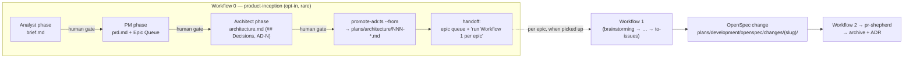
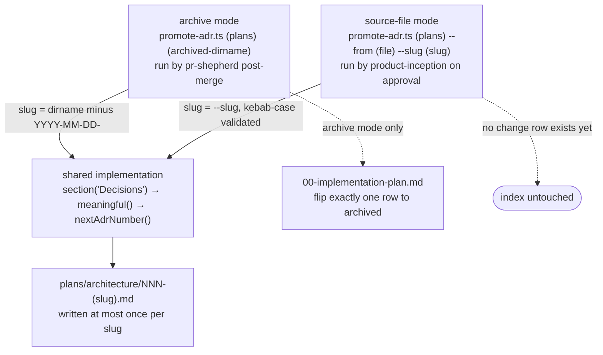

# Design: product-inception-layer

## Context

huhhb is a conforming repo (LD-1 layout, `huhhb` OpenSpec store) [3 L204].
Change-scale work flows through core-workflows Workflow 1 [1 L110-128]; nothing
upstream of it exists — a new product or major initiative has no home for its
brief, PRD, or product-architecture thinking before the first OpenSpec change is
opened. The gap is real but narrow: it is a *planning-artifact* gap, not a
decomposition gap, because everything downstream of "here is the work" is
already owned end to end [1 L145-166].

BMAD-METHOD (v6.10.0, installed locally as an untracked reference under
`.claude/skills/bmad-*` and `_bmad/`) models the upstream phases well:
Analyst (product brief) → PM (PRD) → Architect (architecture spine), each a
persona over a workflow skill with per-phase finalize gates [8]. Its PRD carries
**no epics** — sequencing lives downstream in its story layer
(`bmad-create-epics-and-stories` onward) [8], which is exactly the layer that
would compete with our OpenSpec + `to-issues` + `pr-shepherd` substrate
[1 L124, L161]. That single structural fact is what makes "take the phases,
refuse the story layer" a clean cut rather than a compromise: the boundary BMAD
itself draws between PRD and stories is the boundary this design adopts.

Human decisions (2026-07-21, resolved via interview before this design) [9]:
skill named `product-inception`, also enterable by explicit user invocation
for architecture-scale/BMAD-style brainstorming; web-bundle manual path
documented as allowed; epic queue lives in `prd.md` only; inception ADRs
promote immediately on architecture approval; template trim list approved.

## Source Context

Six bodies of material constrain this design, and each closes off an option that
would otherwise look reasonable.

**The substrate downstream of inception is already complete, and it already owns
decomposition.** Workflow 1 is ten dispatched steps terminating in `to-issues`,
which emits the change's `tasks.md` and publishes dependency-ordered tracker
issues [1 L110-128]; Workflow 2 runs execution through to `pr-shepherd`'s
post-merge close-out [1 L145-166]. Nothing in that chain is missing a work-
breakdown layer — which is why Decision 2 terminates inception at the
architecture document instead of importing one. Both workflows also carry a
documented non-conforming-repo degradation (a single `docs/plans/<slug>.md`,
conforming-only steps skipped with a note) [1 L49-71], so Decision 3's
degradation is an instance of an existing pattern rather than a new mechanism.

**The index has exactly four writers, enumerated canonically and marked
non-restatable.** `repo-kickstart` seeds the file, `to-issues` adds a change's
row, Workflow 2 step 7 refreshes statuses, and `promote-adr.ts` flips a row to
`archived` — "reference this list; don't restate subsets" [2 L17-22]. That
enumeration is the whole argument for Decision 5: an `inception`-status row would
make a fifth writer and force an amendment to a list whose stability is its
point.

**`promote-adr.ts` was already factored for a second source before this change
asked for one.** Extraction is a single `section(md, "Decisions")` helper
[6 L37-47], numbering a single `nextAdrNumber(archDir)` [6 L53-62], and
idempotency a slug match against existing ADRs [6 L119-120] — none of the three
reads the archive directory. Only slug derivation and the index flip are
archive-specific [6 L93-97]. Decision 4 is therefore an adapter at an existing
seam, not a second promoter, and the shipped `--from <file> --slug <slug>` mode
reuses all three helpers unchanged [6 L19-23, L74-89].

**Provider routing is a pair of tables, and both already have the shape this
change needs.** The tier table pins COMPLEX per provider [4 L67-75]; the
skill→provider affinity table assigns planning-judgment prose to claude_code with
codex cross-review [4 L137-143]; Fable is reserved for work carrying a stated
reason Opus is insufficient [4 L93-96]. Decision 6 fills in existing columns; it
adds no routing machinery.

**Two house conventions bound how this can ship at all.** `repo-kickstart`'s
golden rule is detect-before-write, never overwrite content you didn't create,
idempotent [5 L19, L174] — which the non-mandatory `plans/product/` seeding in
Decision 3 must satisfy exactly. And `writing-skills` maps RED/GREEN onto skill
authoring: the test fails when the agent violates the rule *without* the skill
and passes when it complies *with* the skill present [7 L30-45]. That mapping is
what makes the pressure tests a gate rather than a demo. The repo's bar adds
three registration requirements and at least one real G1 bench scenario
[10 L58-60, L82-86].

**BMAD is read, not taken.** The v6.10.0 install is untracked reference material:
personas under `.claude/skills/bmad-agent-{analyst,pm,architect}/`, templates
under the `bmad-product-brief` / `bmad-prd` / `bmad-architecture` skills, and
epic sequencing isolated in `bmad-create-epics-and-stories/steps/step-02-design-epics.md`
[8]. Upstream is MIT-licensed per the project, but the local install ships no
`LICENSE` file — so that is an assumption to verify at adaptation time, recorded
as such in the skill's attribution note, not a claim this design verified [8][11].

## Goals / Non-Goals

**Goals:**
- A gated `skills/product-inception/` skill wrapping the three phases,
  house-style, terminating at the architecture document.
- "Workflow 0 — Product Inception (opt-in, rare)" in
  `buhhdy/skills/core-workflows/SKILL.md`, with routing rules in
  `routing-guide` + `config.yaml` and decision record LD-3 in
  `buhhdy/README.md`.
- Immediate ADR promotion of inception architecture decisions, reusing
  `promote-adr.ts`.
- `repo-kickstart` seeds `plans/product/` (non-mandatory).
- Pressure tests per `writing-skills` TDD.

**Non-Goals:**
- No story/sprint/Scrum-Master/Dev layer, no `stories/` directory, no second
  implementation index.
- No vendoring of BMAD-METHOD (no npm install, no submodule, no committed
  copies of its files).
- No auto-trigger or default path into Workflow 0; Workflow 1 stays the
  default entry point.
- No change to Workflow 1/2 semantics, `pr-shepherd`, `to-issues`, or the
  four index writers; no weakening of `brainstorming`'s hard gate.

## Target Outcome

After this change lands, a genuine product inception has a home: an explicit
request enters Workflow 0, produces three human-gated artifacts under
`plans/product/<slug>/`, promotes its architecture decisions as ADRs the
moment they're approved, and hands Workflow 1 a dependency-ordered epic queue
— while every feature and change keeps flowing through Workflow 1 exactly as
today. The diagram shows the full pipeline and where inception's ownership
ends (everything right of the handoff already exists and is untouched):



### Seams and interfaces

The inception layer touches the rest of the system through exactly three
seams, each with a deliberately small interface — everything else (personas,
templates, gates, degradation) is implementation hidden behind the skill:

- **The Epic Queue seam** (inception → change planning). Interface: the PRD's
  Epic Queue section — value-grouped epics, dependency order, FR-coverage map.
  Workflow 1 is the caller; it needs nothing else from inception [1 L104]. This
  is why the queue lives in `prd.md` only: one seam, one artifact, no index
  coupling.
- **The promotion seam** (inception → ADR store). Interface: a literal
  `## Decisions` section with `AD-N` blocks. `promote-adr.ts` gains a second
  adapter at its existing source seam — archive-dir mode and source-file mode
  both satisfy the same extraction interface ("two adapters means a real
  seam"); extraction, numbering, and idempotency stay one shared
  implementation [6 L37-62, L119-120], which is the locality argument against a
  second promoter.
- **The routing seam** (buhhdy → Workflow 0). Interface: one routing rule with
  an explicit-request precondition and a Workflow-1 tie-breaker [4 L38-47].
  Nothing else in routing changes.

The promotion seam is the one worth drawing, because "two adapters, one
implementation" is a claim about where the divergence stops. Both modes differ
only in how they derive a slug and whether they touch the index; from extraction
onward they are the same code path, which is what keeps the two promotion
timings from drifting into two promotion behaviors:



## Decision Criteria

Every option below was judged against the same six criteria. They are ordered:
when two conflict the higher one wins, which is how tempting-but-losing options
("also put the epic queue in the index, for discoverability") were settled once
rather than re-argued per decision.

| # | Criterion | Why it binds here | Governs |
|---|-----------|-------------------|---------|
| C1 | **One substrate for decomposition** | Two answers to "what work exists" is the failure LD-3 names by name; `to-issues` and `pr-shepherd` already own it [1 L124, L161][3 L275-279] | 2, 5, Non-Goals |
| C2 | **Extend an existing seam before adding a mechanism** | Every mechanism added here is a second thing to keep in sync with the first; `promote-adr.ts` was already factored for a second source [6 L37-62] | 3, 4, 6 |
| C3 | **Explicit entry, never inferred** | Inception costs hours where a change costs minutes; at baseline an agent right-sized a small feature correctly *because no inception skill existed*, so this change introduces the over-trigger risk rather than inheriting it [12 L62-76] | 1, Risks |
| C4 | **Adapt, never vendor** | The local BMAD install is untracked and carries no `LICENSE`; a vendored copy would be an unversioned dependency on someone else's method [8] | 7, Non-Goals |
| C5 | **Degrade, never mandate** | Most repos are non-conforming and `repo-kickstart` is opt-in per LD-1 [3 L204][1 L59-71] | 3, Migration |
| C6 | **Testable under the gates that already exist** | `writing-skills` RED/GREEN and the repo's G0/G1 bar apply to a new skill unchanged [7 L30-45][10 L58-60, L82-86] | 1, 2, 4, Migration |

Two criteria deliberately *not* on the list. **Fidelity to BMAD** — the goal is a
usable house artifact, not a faithful port, so a template section is kept when it
earns its place and dropped when it does not (Decision 7); fidelity as a
criterion would have forced the story layer in through the back door. And
**speed of an inception run** — real, but inception is by construction rare, so
ceremony cost is handled as a trade-off in Risks rather than as a veto on the
gates.

## Decisions

1. **Separate skill, not an extended `brainstorming`.** `product-inception`
   is its own skill; `brainstorming` stays change-scale with its hard gate
   untouched. Alternatives: folding into `brainstorming` (rejected — dilutes
   its change-scale focus and risks its gate) and naming it `bmad-inception`
   (rejected — collides with the ~60 locally installed `bmad-*` skills and
   ties the house skill to upstream naming). Entry is explicit-only: genuine
   inception phrases ("new product", "product inception", "new major
   initiative", "greenfield product planning") or an explicit user request
   for a BMAD-style phase — never inferred from task size. **C3.** The
   discipline is load-bearing in a specific, measured way: at baseline a small
   feature under "I want our full planning process" pressure was right-sized
   correctly *because no inception skill existed to reach for* — scenario B is
   the one baseline that PASSED, and its risk is introduced by this change
   rather than fixed by it [12 L62-76]. The trigger rule therefore has to
   preserve a behavior, not repair one. It reduces to two AND-ed gates, and the
   tie-breaker is a default rather than a coin flip:

   ```mermaid
   flowchart TD
     R[Incoming request] --> E{"Explicitly asks for\ninception-scale planning?"}
     E -- "no, or unsure" --> W1["Workflow 1 — the default\n(brainstorming → … → to-issues)"]
     E -- yes --> S{"Product- or\ninitiative-scale?"}
     S -- no --> W1
     S -- yes --> W0["Workflow 0 — product-inception"]
     W0 --> G["3 human gates\nbrief → prd → architecture"]
     G --> Q["Epic Queue handoff"]
     Q -->|"one epic at a time"| W1
   ```

2. **Inception terminates at the architecture document; the PRD's Epic Queue
   is the handoff contract.** BMAD's own PRD carries no epics (sequencing
   lives in its story layer) [8], so the house `prd.md` adds an **Epic Queue**
   section: value-grouped epics (never technical layers), dependency-ordered,
   with an FR-coverage map (`FR-1 → Epic 1`) so no requirement drops. The
   skill's terminal step hands over the queue with "run Workflow 1 per epic"
   instructions — thin composition, no bulk-opening of changes. Each picked-up
   epic becomes a normal OpenSpec change whose `proposal.md` links back to its
   PRD epic; Workflow 1 step 1 is seeded with brief/PRD/architecture as
   context [1 L104]. Alternative rejected: adopting BMAD wholesale including its
   story/sprint layer — two competing sources of truth, token/ceremony cost,
   and full overlap with `to-issues`/`pr-shepherd` [1 L124, L161]. This is not a
   speculative failure: at baseline, an agent handed approved brief/PRD/
   architecture and told to finish generated 4 epics, 12 pointed stories with
   Given/When/Then, and a 4-sprint plan, with no sense that decomposition
   belonged to another system [12 L40-60]. **C1 over completeness.** Ratified
   as LD-3 [3 L266-281].

3. **Artifacts live at `plans/product/<initiative-slug>/{brief,prd,architecture}.md`**
   on conforming repos — a sibling to `plans/development/` and
   `plans/architecture/` under the LD-1 layout [2 L23-26][3 L204]. On
   non-conforming repos the three artifacts degrade to a single
   `docs/plans/product-<slug>.md` — core-workflows' existing degradation
   pattern, reused rather than reinvented [1 L59-71]: promotion skipped with a
   one-line note, `repo-kickstart` suggested once, never mandated. The seeding
   obeys `repo-kickstart`'s golden rule, detect-before-write and never
   overwrite [5 L19, L174]. **C5, C2.** Alternative rejected: requiring
   conformance before inception can run — it would make the rarest workflow the
   one with the hardest precondition, and LD-1 makes conformance opt-in on
   purpose [3 L204].

4. **ADR promotion reuses `promote-adr.ts` via a new source-file mode, and
   runs immediately on architecture approval.** A `--from <file> --slug
   <initiative-slug>` invocation reuses the existing `## Decisions`-only
   extraction, next-`NNN` numbering, and per-slug idempotency [6 L37-62,
   L119-120], and skips the index-row flip entirely (there is no change row; the
   missing-row failure path does not apply in this mode) — which is precisely
   why the four-writer enumeration survives untouched [2 L17-22, L110-113].
   `architecture.md` keeps its decision blocks (`AD-N`: rule + rationale) under
   a literal `## Decisions` heading so the section rule applies unchanged.
   Immediate promotion (not deferred to the first epic's archive) puts
   inception decisions where Workflow 1's `investigate` step already looks
   [1 L118]. Alternative rejected: a second promoter or manual copying — two
   mechanisms drift, and the shared helpers make the adapter cheaper than the
   copy. **C2.** Verified by three source-mode cases in the existing conformance
   suite — promotes and leaves the index alone, re-run is idempotent, and a
   no-`## Decisions` architecture exits 0 even with no index file present
   [13 L104-138].

5. **Epic queue lives in `prd.md` only.** `00-implementation-plan.md` gains
   rows only when `to-issues` opens a real change per epic [1 L124] — the
   canonical four-writer enumeration in `openspec-conformance`, which says in
   as many words "reference this list; don't restate subsets," is untouched
   [2 L17-22]. Alternative rejected: `inception`-status index rows (a fifth
   writer, amendment cost, and an index entry for work nobody has committed
   to). Discoverability was the argument for it and it lost to **C1**: the
   queue is one artifact away, and an index row for uncommitted work is a
   second answer to "what is in flight."

6. **Workflow 0 dispatch semantics follow the existing tables.** Each phase is
   a dispatched step: claude_code COMPLEX authoring (planning-judgment work —
   Opus per routing-guide's affinity table; Fable stays escalation-only,
   requiring a stated reason Opus is insufficient) [4 L67-75, L93-96, L137-143],
   opposite-vendor (codex) review after each phase per the Cross-Review Rule
   [1 L28, L90] — the PRD and architecture doc are exactly the hard-to-reverse
   artifacts the rule exists for, and Workflow 1 already routes its own plan
   document the same way [1 L120, L122]. `explaining-plans` (codex primary,
   claude_code reviewer) enriches the architecture doc, mirroring Workflow 1
   step 6 [1 L122]. The terminal handoff step is buhhdy-level. A documented
   manual path allows the Analyst/PM phases to run on a flat-rate chat
   subscription with artifacts pasted back — the per-phase human gates apply
   identically; dispatch stays canonical. **C2** — no new routing surface, only
   new rows in tables that already exist [4 L38-47].

7. **Template adaptation (structure adapted from BMad Method v6.x,
   bmad-code-org, MIT — attributed in the skill's reference.md, nothing
   vendored).** brief.md keeps Executive Summary / Problem / Solution / Who
   This Serves / Constraints / Success Criteria / Scope. prd.md keeps the
   essential spine — Vision, Target Users (JTBD + `UJ-N` journeys), Glossary,
   Capabilities with globally-numbered `FR-N`, Non-Goals, MVP Scope, Success
   Metrics (`SM-N` incl. counter-metrics), Open Questions — plus the house
   Epic Queue; BMAD's optional section menu is dropped by default (pull-in-if-
   earned). architecture.md keeps Design Paradigm, `## Decisions` (`AD-N`
   blocks), Consistency Conventions, Stack, Capability→Architecture Map,
   Deferred. Glossary + global `FR-N` numbering are load-bearing for stable
   cross-references — the FR-coverage map in Decision 2 is unwritable without
   them. **C4:** attribution lives in the skill's `reference.md` [11], nothing
   is vendored, and the MIT claim is carried as upstream-stated rather than
   verified, since the local install ships no `LICENSE` file [8]. Alternative
   rejected: keeping BMAD's optional section menu — sections nobody pulled in
   are cost with no reader, and any of them can be added back when one is
   actually earned.

## Risks / Trade-offs

- [Agents escalate change-scale work into inception ceremony] → this is the
  risk this change *creates*, and the baseline proves it was absent before:
  scenario B passed without the skill and its failure mode is introduced by
  installing one [12 L62-76]. Mitigated by trigger discipline in the
  description, a "When NOT to use" section citing the cost asymmetry (a change
  through OpenSpec is minutes; inception is hours), the when-in-doubt-Workflow-1
  tie-breaker in both routing surfaces [1 L80-82][4 L38-47], and pressure test B
  (small feature must NOT trigger) — which passed with the skill installed,
  the agent ruling itself out by quoting its own description [12].
- [`promote-adr.ts` mode drift between archive and source-file paths] → one
  script, shared extraction/numbering helpers [6 L37-62], new cases in the
  existing `tests/test_openspec_conformance.test.ts` [13 L104-138]. Residual: a
  future change to slug derivation still has two call sites to keep honest;
  they are eight lines apart in one file, which is the cheapest form this risk
  takes.
- [Overlap with `brainstorming`/`writing-plans`/`discovering-context`] →
  explicit route-away text in the skill; `evolve-map` run post-merge must
  report no unflagged overlap (definition of done) [14 task 5.3].
- [Manual web-bundle path bypassing gates] → pasted-back artifacts pass the
  same per-phase approval gates before the next phase starts; the skill
  records approval per phase. The gate is human approval by definition — the
  baseline run self-granted "approved in principle" and that is exactly the
  rationalization the skill names and refuses [12 L96-98].
- [Workflow 0 used as a default by habit] → intro text marks it exceptional
  [1 L80-82]; LD-3 records the boundary [3 L266-281]; routing tie-breaker
  defaults to Workflow 1 [4 L38-47].
- [Inception ADRs land before any code exists, and could be wrong] → accepted.
  Immediate promotion is the point: Workflow 1's `investigate` step reads
  `plans/architecture/` [1 L118], so a decision that is not there yet cannot
  inform the first epic. A superseded inception ADR is corrected the way every
  other ADR is; a missing one is silently re-decided per epic, which is worse.

## Migration Plan

Deliverables land as reviewed PRs (batched per the operator's one-branch
convention; pressure-test transcripts as evidence on the skill PR). Dry run on
a scratch repo: Workflow 0 end-to-end on a toy product — confirm termination
at architecture, epic-queue handoff, and one epic consumed by a subsequent
Workflow 1 run. `evolve-map` after merge to confirm clean registration.
Rollback: revert the PRs; `plans/product/` trees on adopting repos are inert
documents.

## Open Questions

None — the five open questions in the originating prompt were resolved with
the human on 2026-07-21 (recorded in Context above).

## References

Repo files are cited `path:line-range` at the state of branch
`feat/two-store-memory-setup` (re-verified 2026-08-02; originally verified
2026-07-21). Line numbers drift as those files change, so where both are given
the **section anchor is authoritative**.

Some of what is cited here is *output of this change*, not input it rested on —
LD-3 in [3], the Inception-promotion subsection in [2], the source-file mode in
[6], and all of [11], [12], [13]. Each is marked inline. They are cited as the
ratified record of a decision argued here, or as verification that it works;
never as the evidence that produced it. The evidence is [1], [2] (four-writer
enumeration), [4], [5], [6] (shared helpers), [7], [8], and [9].

1. `buhhdy/skills/core-workflows/SKILL.md` *(repo file, 233 lines)* — Cross-Review Rule,
   L28; conforming vs non-conforming detection and the degradation pattern,
   L49-71; Workflow 0 intro and its "explicitly requested, never inferred"
   rule, L75-90, with the phase table L99-104 and end state L107-108;
   Workflow 1 table, L110-128 (`investigate` reads prior context L118;
   `writing-plans` COMPLEX + codex review L120; `explaining-plans` L122;
   `to-issues` writes the index L124); Workflow 2 table and `pr-shepherd`
   close-out, L145-166.
2. `skills/openspec-conformance/SKILL.md` *(repo file, 119 lines)* — four-writer
   index enumeration marked non-restatable, L17-22; adopted layout, L23-26;
   "Inception promotion" subsection with the canonical `--from` invocation and
   the explicit statement that the four-writer enumeration is unchanged by it,
   L96-113. *(The Inception-promotion subsection is an output of this change.)*
3. `buhhdy/README.md` *(repo file)* — §"Planning Layout", LD-1 opt-in conformance record,
   L202-204; **LD-3 (2026-07-21)**, L266-281, including the verbatim rejected
   alternative (BMAD wholesale → two competing sources of truth, ceremony cost,
   `to-issues`/`pr-shepherd` overlap), L275-279. *(LD-3 is the ratified record
   of Decision 2, written by this change — cited as the decision's home, not as
   its evidence.)*
4. `buhhdy/skills/routing-guide/SKILL.md` *(repo file)* — "Inception vs Change Routing"
   (added 2026-07-21) with the explicit-request precondition and
   when-in-doubt-Workflow-1 tie-breaker, L38-47; model tier table, L67-75;
   Fable-is-escalation-only with a stated-reason requirement, L93-96;
   skill→provider affinity, L137-143 (the `product-inception` row, L143).
5. `skills/repo-kickstart/SKILL.md` *(repo file)* — golden rule (detect before
   you write, read existing files fully), L19, restated L174;
   `plans/product/README.md` seeding, L84; the "never mandate" framing, L56.
6. `skills/openspec-conformance/promote-adr.ts` *(repo file, 209 lines)* — header contract
   for both modes, L4-23; `section(md, heading)` extraction, L37-47;
   `meaningful()`, L49-51; `nextAdrNumber(archDir)`, L53-62; source-mode flag
   parsing and kebab-case slug validation, L74-89; archive-only slug derivation
   and design path, L93-97; per-slug idempotency guard, L119-120. *(The
   source-file mode, L19-23 and L74-89, is an output of this change.)*
7. `skills/writing-skills/SKILL.md` *(repo file)* — TDD-for-skills mapping
   (RED = agent violates the rule without the skill; GREEN = complies with it
   present), L30-45; SKILL.md structure, L93-138. Frontmatter convention (no
   `triggers:` field; trigger phrases live in `description`) —
   `.claude/memory/feedback-skill-frontmatter.md`.
8. BMAD-METHOD v6.10.0 *(local install, untracked — reference material, nothing
   vendored)* — personas in
   `.claude/skills/bmad-agent-{analyst,pm,architect}/`, templates in the
   `bmad-product-brief` / `bmad-prd` / `bmad-architecture` skill assets, epic
   sequencing isolated in
   `bmad-create-epics-and-stories/steps/step-02-design-epics.md` (four steps:
   validate → design epics → create stories → validate). Upstream:
   github.com/bmad-code-org/BMAD-METHOD. **Assumption, not verified:** MIT is
   the upstream-stated license; the local install ships no `LICENSE` file —
   confirm against upstream at adaptation time.
9. Design interview with the user, 2026-07-21 *(user-supplied; conversation,
   not a file)* — the five scope decisions listed in Context: skill naming,
   web-bundle manual path, PRD-only epic queue, immediate ADR promotion,
   template trim list.
10. `AGENTS.md` *(repo file)* — skill registration requirements
    (`marketplace.json` entry, `onboarding/skills-list.md` line, at least one
    real G1 bench scenario), L58-60; G0 `skill-lint.ts` / G1 `skill-bench.ts`
    quality bar, L82-86.
11. `skills/product-inception/reference.md:5-9` *(repo file, produced by this
    change)* — the BMad Method attribution
    note and the statement that the Epic Queue is a house addition, upstream
    sequencing epics downstream of the PRD.
12. `plans/development/openspec/changes/product-inception-layer/pressure-test-evidence.md`
    *(repo file, 100 lines, produced by this change)* — GREEN results L2-36;
    RED baselines L38-100. Load-bearing
    specifics: scenario C baseline generated 4 epics / 12 pointed stories /
    4 sprints unprompted, L40-60; scenario B **passed at baseline** and its
    risk is introduced by the new skill, L62-76; scenario A baseline
    self-granted "approved in principle" in place of a human gate, L96-98.
13. `tests/test_openspec_conformance.test.ts` *(repo file; these cases produced
    by this change)* — three source-file-mode cases: promotes one ADR and never
    touches the index, L104-120; re-run is idempotent, L121-130; no
    `## Decisions` exits 0 with no index file present, L131-139. Run offline
    with `node --test tests/test_openspec_conformance.test.ts`.
14. `plans/development/openspec/changes/product-inception-layer/tasks.md`
    *(repo file)* — the
    execution record; task 5.3 (`evolve-map` reports no unflagged overlap) is
    the definition of done cited in Risks, and 5.4 (PR + archive) is the only
    open item.
