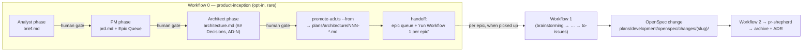

# Design: product-inception-layer

## Context

huhhb is a conforming repo (LD-1 layout, `huhhb` OpenSpec store). Change-scale
work flows through core-workflows Workflow 1; nothing upstream of it exists —
a new product or major initiative has no home for its brief, PRD, or
product-architecture thinking before the first OpenSpec change is opened.

BMAD-METHOD (v6.10.0, installed locally as an untracked reference under
`.claude/skills/bmad-*` and `_bmad/`) models the upstream phases well:
Analyst (product brief) → PM (PRD) → Architect (architecture spine), each a
persona over a workflow skill with per-phase finalize gates. Its PRD carries
**no epics** — sequencing lives downstream in its story layer
(`bmad-create-epics-and-stories` onward), which is exactly the layer that
would compete with our OpenSpec + `to-issues` + `pr-shepherd` substrate.

Human decisions (2026-07-21, resolved via interview before this design):
skill named `product-inception`, also enterable by explicit user invocation
for architecture-scale/BMAD-style brainstorming; web-bundle manual path
documented as allowed; epic queue lives in `prd.md` only; inception ADRs
promote immediately on architecture approval; template trim list approved.

## Goals / Non-Goals

**Goals:**
- A gated `skills/product-inception/` skill wrapping the three phases,
  house-style, terminating at the architecture document.
- "Workflow 0 — Product Inception (opt-in, rare)" in
  `buhhdy/skills/core-workflows/SKILL.md`, with routing rules in
  `routing-guide` + `config.yaml` and decision record LD-3 in
  `buhhdy/README.md`.
- Immediate ADR promotion of inception architecture decisions, reusing
  `promote-adr.ts`.
- `repo-kickstart` seeds `plans/product/` (non-mandatory).
- Pressure tests per `writing-skills` TDD.

**Non-Goals:**
- No story/sprint/Scrum-Master/Dev layer, no `stories/` directory, no second
  implementation index.
- No vendoring of BMAD-METHOD (no npm install, no submodule, no committed
  copies of its files).
- No auto-trigger or default path into Workflow 0; Workflow 1 stays the
  default entry point.
- No change to Workflow 1/2 semantics, `pr-shepherd`, `to-issues`, or the
  four index writers; no weakening of `brainstorming`'s hard gate.

## Target Outcome

After this change lands, a genuine product inception has a home: an explicit
request enters Workflow 0, produces three human-gated artifacts under
`plans/product/<slug>/`, promotes its architecture decisions as ADRs the
moment they're approved, and hands Workflow 1 a dependency-ordered epic queue
— while every feature and change keeps flowing through Workflow 1 exactly as
today. The diagram shows the full pipeline and where inception's ownership
ends (everything right of the handoff already exists and is untouched):

### Seams and interfaces

The inception layer touches the rest of the system through exactly three
seams, each with a deliberately small interface — everything else (personas,
templates, gates, degradation) is implementation hidden behind the skill:

- **The Epic Queue seam** (inception → change planning). Interface: the PRD's
  Epic Queue section — value-grouped epics, dependency order, FR-coverage map.
  Workflow 1 is the caller; it needs nothing else from inception. This is why
  the queue lives in `prd.md` only: one seam, one artifact, no index coupling.
- **The promotion seam** (inception → ADR store). Interface: a literal
  `## Decisions` section with `AD-N` blocks. `promote-adr.ts` gains a second
  adapter at its existing source seam — archive-dir mode and source-file mode
  both satisfy the same extraction interface ("two adapters means a real
  seam"); extraction, numbering, and idempotency stay one shared
  implementation, which is the locality argument against a second promoter.
- **The routing seam** (buhhdy → Workflow 0). Interface: one routing rule with
  an explicit-request precondition and a Workflow-1 tie-breaker. Nothing else
  in routing changes.

## Decisions

1. **Separate skill, not an extended `brainstorming`.** `product-inception`
   is its own skill; `brainstorming` stays change-scale with its hard gate
   untouched. Alternatives: folding into `brainstorming` (rejected — dilutes
   its change-scale focus and risks its gate) and naming it `bmad-inception`
   (rejected — collides with the ~60 locally installed `bmad-*` skills and
   ties the house skill to upstream naming). Entry is explicit-only: genuine
   inception phrases ("new product", "product inception", "new major
   initiative", "greenfield product planning") or an explicit user request
   for a BMAD-style phase — never inferred from task size.

2. **Inception terminates at the architecture document; the PRD's Epic Queue
   is the handoff contract.** BMAD's own PRD carries no epics (sequencing
   lives in its story layer), so the house `prd.md` adds an **Epic Queue**
   section: value-grouped epics (never technical layers), dependency-ordered,
   with an FR-coverage map (`FR-1 → Epic 1`) so no requirement drops. The
   skill's terminal step hands over the queue with "run Workflow 1 per epic"
   instructions — thin composition, no bulk-opening of changes. Each picked-up
   epic becomes a normal OpenSpec change whose `proposal.md` links back to its
   PRD epic; Workflow 1 step 1 is seeded with brief/PRD/architecture as
   context. Alternative rejected: adopting BMAD wholesale including its
   story/sprint layer — two competing sources of truth, token/ceremony cost,
   and full overlap with `to-issues`/`pr-shepherd`.

3. **Artifacts live at `plans/product/<initiative-slug>/{brief,prd,architecture}.md`**
   on conforming repos — a sibling to `plans/development/` and
   `plans/architecture/` under the LD-1 layout. On non-conforming repos the
   three artifacts degrade to a single `docs/plans/product-<slug>.md`
   (core-workflows' degradation pattern): promotion skipped with a one-line
   note, `repo-kickstart` suggested once, never mandated.

4. **ADR promotion reuses `promote-adr.ts` via a new source-file mode, and
   runs immediately on architecture approval.** A `--from <file> --slug
   <initiative-slug>` invocation reuses the existing `## Decisions`-only
   extraction, next-`NNN` numbering, and per-slug idempotency, and skips the
   index-row flip entirely (there is no change row; the missing-row failure
   path does not apply in this mode). `architecture.md` keeps its decision
   blocks (`AD-N`: rule + rationale) under a literal `## Decisions` heading so
   the section rule applies unchanged. Immediate promotion (not deferred to
   the first epic's archive) puts inception decisions where Workflow 1's
   `investigate` step already looks. Alternative rejected: a second promoter
   or manual copying — two mechanisms drift.

5. **Epic queue lives in `prd.md` only.** `00-implementation-plan.md` gains
   rows only when `to-issues` opens a real change per epic — the canonical
   four-writer enumeration in `openspec-conformance` is untouched. Alternative
   rejected: `inception`-status index rows (a fifth writer, amendment cost,
   and an index entry for work nobody has committed to).

6. **Workflow 0 dispatch semantics follow the existing tables.** Each phase is
   a dispatched step: claude_code COMPLEX authoring (planning-judgment work —
   Opus per routing-guide; Fable stays escalation-only), opposite-vendor
   (codex) review after each phase per the Cross-Review Rule — the PRD and
   architecture doc are exactly the hard-to-reverse artifacts the rule exists
   for. `explaining-plans` (codex primary, claude_code reviewer) enriches the
   architecture doc. The terminal handoff step is buhhdy-level. A documented
   manual path allows the Analyst/PM phases to run on a flat-rate chat
   subscription with artifacts pasted back — the per-phase human gates apply
   identically; dispatch stays canonical.

7. **Template adaptation (structure adapted from BMad Method v6.x,
   bmad-code-org, MIT — attributed in the skill's reference.md, nothing
   vendored).** brief.md keeps Executive Summary / Problem / Solution / Who
   This Serves / Constraints / Success Criteria / Scope. prd.md keeps the
   essential spine — Vision, Target Users (JTBD + `UJ-N` journeys), Glossary,
   Capabilities with globally-numbered `FR-N`, Non-Goals, MVP Scope, Success
   Metrics (`SM-N` incl. counter-metrics), Open Questions — plus the house
   Epic Queue; BMAD's optional section menu is dropped by default (pull-in-if-
   earned). architecture.md keeps Design Paradigm, `## Decisions` (`AD-N`
   blocks), Consistency Conventions, Stack, Capability→Architecture Map,
   Deferred. Glossary + global `FR-N` numbering are load-bearing for stable
   cross-references.

## Risks / Trade-offs

- [Agents escalate change-scale work into inception ceremony] → trigger
  discipline in the description, a "When NOT to use" section citing the cost
  asymmetry (change through OpenSpec is minutes; inception is hours), the
  when-in-doubt-Workflow-1 tie-breaker in both routing surfaces, and pressure
  test 2 (small feature must NOT trigger).
- [`promote-adr.ts` mode drift between archive and source-file paths] → one
  script, shared extraction/numbering helpers, new cases in the existing
  `tests/test_openspec_conformance.test.ts`.
- [Overlap with `brainstorming`/`writing-plans`/`discovering-context`] →
  explicit route-away text in the skill; `evolve-map` run post-merge must
  report no unflagged overlap (definition of done).
- [Manual web-bundle path bypassing gates] → pasted-back artifacts pass the
  same per-phase approval gates before the next phase starts; the skill
  records approval per phase.
- [Workflow 0 used as a default by habit] → intro text marks it exceptional;
  LD-3 records the boundary; routing tie-breaker defaults to Workflow 1.

## Migration Plan

Deliverables land as reviewed PRs (batched per the operator's one-branch
convention; pressure-test transcripts as evidence on the skill PR). Dry run on
a scratch repo: Workflow 0 end-to-end on a toy product — confirm termination
at architecture, epic-queue handoff, and one epic consumed by a subsequent
Workflow 1 run. `evolve-map` after merge to confirm clean registration.
Rollback: revert the PRs; `plans/product/` trees on adopting repos are inert
documents.

## Open Questions

None — the five open questions in the originating prompt were resolved with
the human on 2026-07-21 (recorded in Context above).

## References

Source context this design rests on (all verified in-repo on 2026-07-21):

1. `buhhdy/skills/core-workflows/SKILL.md` — Workflow 1/2 tables, dispatch
   kinds, Cross-Review Rule, conformance detection, degradation pattern.
2. `skills/openspec-conformance/SKILL.md` + `skills/openspec-conformance/promote-adr.ts`
   — the four-writer index enumeration, `## Decisions`-only extraction,
   next-`NNN` numbering, per-slug idempotency, missing-row failure path.
3. `buhhdy/README.md` §"Planning Layout" — LD-1 opt-in record and the
   2026-07-14 store-registration decision LD-3 will sit beside.
4. `buhhdy/skills/routing-guide/SKILL.md` — tier table, skill→provider
   affinity (planning judgment → Opus; Fable escalation-only), cross-review
   pairings.
5. `skills/repo-kickstart/SKILL.md` — golden rule (detect-before-write,
   idempotent, non-destructive), planning-tree seeding, checklist format.
6. `skills/writing-skills/SKILL.md` — TDD-for-skills (RED baseline → GREEN →
   REFACTOR), frontmatter conventions; `.claude/memory/feedback-skill-frontmatter.md`
   — no `triggers:` field, trigger phrases live in `description`.
7. Local BMAD-METHOD v6.10.0 install (untracked): personas in
   `.claude/skills/bmad-agent-{analyst,pm,architect}/customize.toml`, templates
   in `bmad-product-brief`/`bmad-prd`/`bmad-architecture` assets, epic
   sequencing in `bmad-create-epics-and-stories/steps/step-02-design-epics.md`.
   Upstream: github.com/bmad-code-org/BMAD-METHOD (MIT — verify against
   upstream at adaptation time; the local install carries no license file).
8. Human interview decisions, this session (2026-07-21): naming, web-bundle
   path, PRD-only epic queue, immediate promotion, template trim.
