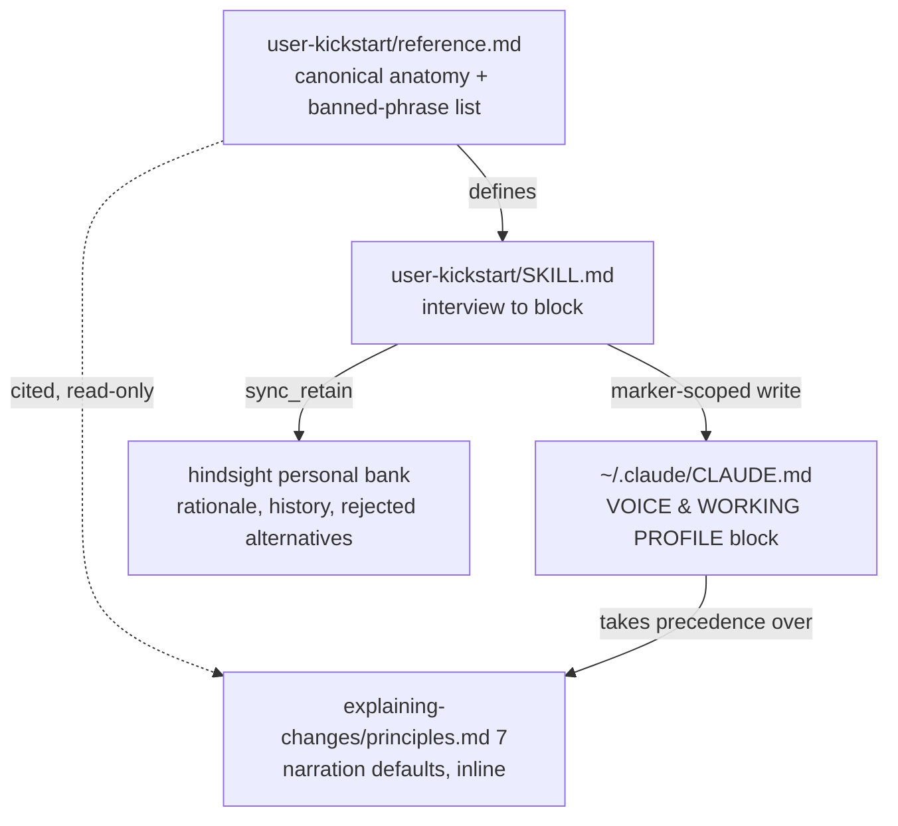

# Design: voice-anatomy-layer

## Context

Two surfaces in this setup govern how Claude writes, and neither is specified.

`skills/explaining-changes/` (SKILL.md + principles.md) is a live-narration skill: it
fires at three checkpoints [1 §5], caps at ~4 sentences [1 §4], and gates diagrams
behind "structure or control flow actually changed" [1 §3]. Its only voice rule is the
one-line "educate, don't report" [2]. Two failure modes follow directly from that
thinness — prose degrades into an edit log, and the §3 gate suppresses the diagram on
the majority of increments, which defeats the reason the user turned the skill on.

`~/.claude/CLAUDE.md` on this machine is 136 lines, all of it one delimited managed
block: `# >>> TWO-STORE MEMORY ROUTING (BEGIN — delete this whole block to revert) >>>`
… `# <<< TWO-STORE MEMORY ROUTING (END) <<<` [3 L1, L136]. The convention — a named,
self-documenting, independently revertible block — already exists and is proven;
nothing needs to be invented for a second block to coexist with it.

The source for both is the five-section voice-prompt anatomy: identity statement,
baseline voice rules, explicit patterns, anti-patterns, context shifts [10]. It is a
prompt-authoring pattern, not a style guide, and its value is that each section is
enforceable and testable in a way "educate, don't report" is not.

Prior art that must not be duplicated or displaced:
`claude-md-management:claude-md-improver` (project CLAUDE.md coverage audit, A–F
rubric, write-capable) [8], `/revise-claude-md` (session learnings → repo CLAUDE.md)
[9], `update-config` (settings.json and hooks), `memory-setup` (machine-level
store installation), `memory-onboarding` (memory-strata health).

Human decisions resolved by interview before this design (2026-08-01) [11]: scope is
voice **plus** goals with per-answer store routing; the interview is **cold first,
evidence audit second**; `explaining-changes` ships baked-in voice defaults that a user
voice block overrides; the new skill is a **huhhb repo skill** with full gates; the
anatomy has **one owner** (`user-kickstart/reference.md`) and one reader; diagrams stay
**default-on**; a **specificity mandate** is added.

## Source Context

Five bodies of material constrain this change, and each one closes off options that
would otherwise look reasonable.

**The skill being modified is small and its rules are load-bearing.** principles.md is
54 lines across six numbered sections [1]; SKILL.md is 94 lines [2]. Every constraint
this design keeps — prose-before-diagram [1 §1], ASCII-only with ≤6 nodes [1 §2], the
three checkpoints [1 §5], the `caveman-commit` hand-off and `training` yield [2 L50-54]
— is a single line or two in those files. That is why §3 and the ceiling can be changed
surgically: there is no machinery around them to migrate, and the change is legible in
a diff.

**The user's two-store policy already answers "where does this fact live."** The
machine-level CLAUDE.md sets read routing [3 L31], write routing [3 L64], `sync_retain`
over `retain` because `retain` returns an acceptance receipt rather than a confirmation
[3 L66], a never-retain list [3 L73+], and a measured cost table putting `sync_retain`
at ~7 s and two model calls [3 L102]. The `personal` bank is already defined as
cross-project preferences and working style [3 L122]. Decision 7 is therefore an
application of an existing policy, not a new one — which is what makes it cheap to
review.

**The repo's quality bar is fixed and this change must clear it unmodified.** A new
skill needs a `marketplace.json` entry, an `onboarding/skills-list.md` line, and at
least one real G1 bench scenario [4 L58-60]; G0 is `scripts/skill-lint.ts` and G1 is
`scripts/skill-bench.ts` [4 L82-86]. The bench measures a skill against a
skill-disabled A/B run — `--disallowedTools Skill` on the baseline arm [6 L136-141] —
which is structurally a RED/GREEN pair. Both fixtures already exist as captured RED
baselines [12].

**Two failure classes in this repo are documented, not hypothetical.** A description
that summarizes workflow creates a shortcut the model takes in place of reading the
body — measured, with "code review between tasks" collapsing a two-stage review to one
[5]. And a rule stated in prose drifting from the example directly beneath it recurred
across multiple review rounds on a single file, which is why it is recorded as a class
of defect rather than a typo [7]. Decisions 11 and 1/4 exist to avoid re-running those
two experiments.

**The prompt anatomy is adapted, not vendored.** The five sections come from an
external prompt-authoring pattern [10]; nothing is copied verbatim, and the repo's own
wording owns the result. The claim that each section is independently enforceable is
this design's assertion about the pattern, not a claim the source makes.

## Goals / Non-Goals

**Goals:**

- `explaining-changes` narration that names real files, symbols, and values, and
  carries a before → after diagram on every increment where anything moved.
- A `user-kickstart` skill that establishes a user-level voice-and-goals profile by
  interview, audits its own draft against the user's real artifacts, and writes an
  idempotent, revertible, size-capped managed block.
- Per-answer routing that keeps always-loaded context small: directives to
  `~/.claude/CLAUDE.md`, rationale and history to the hindsight `personal` bank.
- One owner for the anatomy and the banned-phrase list, so the rule and its examples
  cannot drift apart.

**Non-Goals:**

- No repo-level CLAUDE.md or AGENTS.md authoring — that is `claude-md-improver` and
  `/revise-claude-md`, and `user-kickstart` routes to them by name.
- No settings.json, hooks, or permissions — that is `update-config`.
- No store installation or repair — that is `memory-setup`.
- No automatic writes. Nothing reaches `~/.claude/CLAUDE.md` or the `personal` bank
  without a shown diff and an explicit approval.
- No inference-only profile. The interview is the source; the audit is a check on it.
- No new shared abstraction directory in `skills/`.

## Target Outcome

A user with both pieces installed gets narration that reads like this, unprompted, at
every checkpoint:

> `flush.ts` now retries the cursor write twice before dropping it, so a transient 503
> no longer loses the journal entry. The retry sits inside the existing lock, so
> ordering is unchanged.
>
> ```
> before:  [flush] --> [journal]
> after:   [flush] --> [retry x2]* --> [journal]     * new
> ```

…and a `~/.claude/CLAUDE.md` that gained a second managed block of at most 60 lines,
every line of which is a directive that changes output, with the reasoning behind
those directives living in the `personal` bank where it costs nothing per session.

### Seams and interfaces

The diagram below shows which artifact owns what, and in which direction each
dependency points. Solid arrows are writes or definitions; the dashed arrow is the one
read-only citation this change introduces. Note that no arrow returns to
`reference.md` — that one-way shape is what keeps the two consumers from drifting.



The override chain this change introduces resolves user block → `caveman` → §7
defaults. It sits on top of, and does not alter, the existing rule that
`explaining-changes` goes quiet entirely when `training` is active [1 §6][2 L53-58].

A note on medium, since this design is *about* diagrams: mermaid is correct for this
document, and stays banned in the narration it specifies. principles.md §2 requires
simple ASCII in chat and says so explicitly [1 §2] — that constraint survives Decision 2
untouched.

Three seams, each independently testable:

- **reference.md → both consumers.** A one-way citation. `explaining-changes` reads it;
  nothing writes back. Removing `user-kickstart` leaves `explaining-changes` with its
  inline defaults intact and one dangling pointer — degraded, not broken.
- **user-kickstart → CLAUDE.md.** Marker-scoped. The only bytes it may touch are those
  between its own `BEGIN`/`END` lines. Everything outside, including the existing
  two-store routing block, is out of contract.
- **CLAUDE.md block → explaining-changes.** Read-only precedence, not a call. The block
  wins on conflict; `explaining-changes` never edits or requires it.

## Decision Criteria

Every option below was judged against the same six criteria. They are ordered: when two
conflict, the higher one wins, which is how ties like "duplicate the list in both
skills" (cheap, but fails C2) were settled without re-litigating each time.

| # | Criterion | Why it binds here | Governs |
|---|-----------|-------------------|---------|
| C1 | **Non-destructive and reversible** | The write target is outside the repo and already holds a block this change does not own [3 L1, L136] | 9, Migration, Rollback |
| C2 | **One owner per fact** | Rule-vs-example drift is a recorded repeat failure in this tree, not a hypothetical [7] | 1, 4 |
| C3 | **Always-loaded context is a budget** | Every line of `~/.claude/CLAUDE.md` is re-read every session; the file is already 136 lines [3] | 7, 8 |
| C4 | **Routes to prior art, never absorbs it** | Four shipped skills already own adjacent scope [8][9] | 10, 11, Non-Goals |
| C5 | **Testable under the existing gates, no new machinery** | G0/G1 are fixed and a new skill must clear them as-is [4 L58-60, L82-86] | 12 |
| C6 | **The user stays the author** | A profile inferred from artifacts cannot express an intention not yet practised [11] | 5, 6 |

Two criteria deliberately *not* on the list: token cost per invocation (real, but
bounded by C3 and treated as a trade-off in Risks rather than a veto) and
discoverability of the new skill (handled by trigger phrases and the bench's positive
list, so it never has to be bought with description text — see Decision 11).

## Decisions

1. **One owner for the anatomy, no shared directory.** `skills/user-kickstart/reference.md`
   is canonical for the five-section anatomy and the banned-phrase list, because it has
   to define both anyway in order to generate conforming blocks. `explaining-changes`
   keeps its narration-specific defaults inline (so it reads standalone) and cites
   reference.md only for the shared list — the one artifact that would otherwise exist
   twice and drift. Alternatives: a `skills/_shared/voice-anatomy.md` third file
   (rejected — a new abstraction and a new directory convention for exactly two
   consumers, and `skills/` is flat by design) and full duplication in both skills
   (rejected — the banned-phrase list is precisely the rule-vs-example drift pattern
   already recorded as a repeat failure in this repo [7]). Accepted cost: the first
   cross-skill file citation in `skills/`, called out in the proposal's Impact. **C2
   over C4.**

2. **The diagram gate is inverted, not loosened.** principles.md §3 changes from "only
   when structure or flow changed" [1 §3] to "at every checkpoint where structure,
   control flow, data shape, or file relationships moved; skipped only when there is
   nothing to draw, and the skip is stated." Diagrams render **before → after** with the
   changed node marked (`[cache]* … * new`) rather than end-state only, because the
   user's stated purpose is scanning *the change*, and an end-state diagram does not
   show one. The ≤6-node, single-level, ASCII, prose-introduced constraints all survive
   [1 §1, §2]. Alternative rejected: keeping the conditional gate and merely widening
   the trigger list — the observed failure is that a conditional gate resolves to "no"
   under a brevity ceiling, so the gate itself is the defect.

3. **The brevity ceiling moves once, explicitly: ≤4 → ≤5 sentences** [1 §4][2 L25-26,
   L45]. Specificity costs words and a per-checkpoint diagram costs lines; leaving the
   ceiling at 4 would make the skill self-contradictory and force silent violation.
   Diagrams stay ≤6 nodes so
   the diagram remains cheaper than the prose it displaces. Alternative rejected:
   removing the ceiling (a ceiling that moves under pressure is not a ceiling, and
   token economy is a stated repo value).

4. **The specificity mandate is reconciled with "educate, don't report" by example, not
   by rule.** The two read as contradictory — one demands named files, the other bans
   "I edited file X" — so §7 resolves it with a paired ✗/✗/✓ block showing that specifics
   are the *subject* of the sentence and never the object of an edit verb. Rules that
   contradict their neighbouring examples are a known repeat failure in this repo [7];
   the example is therefore normative, not illustrative. **C2.**

5. **Cold interview first, evidence audit second.** The user chose this over
   evidence-first drafting. It preserves the ability to state a preference no artifact
   shows yet — a new intention has no git history — and the audit still catches
   aspirational answers, reported as drift rather than silently overriding the user.
   Cost: two passes instead of one. Alternatives rejected: evidence-first-then-confirm
   (cannot express a not-yet-practised preference) and inference-only (no way to state
   a preference at all). **C6, chosen by the user at interview** [11].

6. **The audit is bounded and its bounds are reported.** Last 100 commits across the
   user's repo root, last 20 PR bodies, all `.claude/memory/feedback-*.md`, cached
   evolve conclusions, and one `personal`-bank recall (free, zero LLM calls [3 L102]).
   Each
   drafted rule gets `supported | contradicted | no evidence` with a citation. The
   skill prints what it sampled. Silent truncation would read as "audited everything"
   when it did not.

7. **Routing is a three-part test, and failing any part means it is not a CLAUDE.md
   line.** A rule earns always-loaded context only if it (a) must hold in every session,
   (b) changes output when present, and (c) reads as a directive rather than a
   rationale. Everything else — why a preference exists, what was rejected, past
   corrections, outcomes — goes to the `personal` bank via `sync_retain` [3 L64, L66].
   Project-scoped preferences go to that repo's bank, never `personal` [3 L122].
   This is the user's existing two-store policy applied to a new writer, not a new
   policy. **C3.**

   Each interview answer runs the test once; the three gates are AND-ed, so a single
   "no" routes the answer out of always-loaded context rather than shrinking it.

   ```mermaid
   flowchart TD
       A[Interview answer] --> B{Must hold in<br/>every session?}
       B -- no --> BANK
       B -- yes --> C{Changes output<br/>when present?}
       C -- no --> BANK
       C -- yes --> D{Reads as a directive,<br/>not a rationale?}
       D -- no --> BANK
       D -- yes --> E{Project-scoped?}
       E -- yes --> REPO["that repo's bank"]
       E -- no --> MD["~/.claude/CLAUDE.md block<br/>counts against the 60-line cap"]
       BANK["hindsight personal bank<br/>via sync_retain"]
   ```

8. **The block is hard-capped at 60 lines and the cap is enforced against the user.**
   `~/.claude/CLAUDE.md` is already 136 lines [3] and every line is re-read every
   session. When the interview yields more than 60 lines the skill runs a prune with the
   user rather than growing the block. A soft target would be ignored; this one blocks
   the write. The number is a judgment call — see Risks.

9. **Writes are marker-scoped, backed up, and diff-gated.** Before any write the skill
   copies `~/.claude/CLAUDE.md` to `~/.claude/CLAUDE.md.bak-<timestamp>` and reports the
   path; it then replaces only the bytes between its own `BEGIN`/`END` markers; a re-run
   with no marker present appends a fresh block. The `BEGIN` line carries its own revert
   instruction, matching the existing two-store block verbatim in form [3 L1].
   Alternative rejected: rewriting the whole file from a template — it would destroy the
   memory-routing block, which this skill does not own. **C1.**

10. **Named `user-kickstart`, for symmetry with `repo-kickstart`.** One bootstraps a
    repo into house conventions; this one bootstraps the user. The description is scoped
    tightly to *user-level `~/.claude/CLAUDE.md`, established by interview*, and names
    its four handoffs explicitly so trigger matching does not collide with
    `claude-md-improver` [8], `/revise-claude-md` [9], `update-config`, or
    `memory-setup`. Alternative rejected: `voice-profile` (accurate for the
    voice half, misleading once goals and store routing are in scope). **C4.**

11. **The description carries triggers only, never the workflow.** `writing-skills`
    records a measured failure: a description that summarized a two-stage review as
    "code review between tasks" caused the model to run one review and skip the body's
    flowchart entirely [5]. `user-kickstart` has five phases and the interview is second, so
    a description naming the interview would collapse the skill to its interview and
    silently drop the audit, the routing, and the write gate — the three parts that
    carry the actual discipline. The description therefore names triggers and symptoms
    only. Alternative rejected: a description that mentions the interview for
    discoverability — discoverability is what the trigger phrases and the bench's
    positive list are for, and they cost nothing in shortcut risk.

12. **RED/GREEN runs on `scripts/skill-bench.ts`, not dispatched subagents.**
    `writing-skills` prescribes subagent pressure testing, but a standing instruction in
    this session forbids the Agent tool unless explicitly requested. The repo's own
    harness resolves the conflict without weakening the Iron Law: `tests/bench/<skill>.json`
    scenarios run through `skill-bench.ts`, whose baseline arm re-runs the same prompt
    with `--disallowedTools Skill` [6 L136-141] — a skill-off/skill-on A/B, which is
    exactly a RED/GREEN pair, and which dispatches no subagent. Both fixtures exist with
    baselines already captured [12], satisfying the gate that a new skill ship at least
    one real G1 scenario [4 L58-60]. The rationalization tables may only quote
    transcripts that a pass actually produced. Alternative rejected: skipping the
    baseline because the failure modes seem obvious — an untested skill teaches whatever
    its author already believed. **C5.**

## Risks / Trade-offs

- **More diagrams and more specifics cost tokens on a skill that fires many times per
  session.** Mitigated by the ≤6-node cap, the single-sentence skip note, and the
  ceiling moving by exactly one sentence. **Measured 2026-08-02, and the risk resolved
  in two different directions.** Where the identifiers were already in context,
  specificity was *cheaper* than vagueness — 3326 tokens against a 5977 baseline —
  because a precise short answer beats a padded hand-wave. Where the scenario withheld
  them, the skill arm had to read a 228-line file and came in at 8732 against 5588
  (1.56x), failing the global 1.5x gate with identical turn counts. That failure is
  documented in the fixture and accepted: the gate is not relaxed and the scenario is
  not weakened, because a scenario that hands over the identifiers stops testing
  whether the skill goes and finds them. Real narration runs in the first regime — the
  agent has just edited the file it is describing.
- **The ceiling did not hold on its own.** With §7 active, narration named every
  identifier and drew a correct diagram, then ran ~9 sentences against a ceiling of 5,
  by appending a root-cause retrospective, a why-this-mattered paragraph, and a list of
  neighbouring paths checked. §4 now bounds a checkpoint to one behavior change and
  names those three appendages; §7 carries the matching red flag. Closed after GREEN,
  not yet re-benched.
- **Specificity can leak secrets.** Naming real paths and values is the point, but a
  private-config repo makes that a disclosure surface. §7 carries one carve-out:
  credential values, tokens, and real addresses are named by *variable*, never by value.
- **The cross-skill citation is a new pattern** and a future skill-split or extraction
  could break it. It is one link, in one direction, called out in Impact; a broken link
  degrades `explaining-changes` to its inline defaults rather than failing it.
- **The audit can embarrass the interview.** A user who says "no hedging" and gets back
  twelve hedged commits may resolve by editing the evidence rather than the rule. The
  skill reports drift and stops; it never edits a rule on the user's behalf.
- **`sync_retain` costs ~2 model calls and ~7 s per memory** [3 L102]. A ten-answer
  interview routing five answers to the bank is five writes. The skill batches the
  retain summary for approval first, so the user sees the count before paying it.
- **60 lines may prove too tight** for a user with a genuinely large standing ruleset.
  The failure mode is a forced prune conversation, which is the intended behavior — but
  it is friction, and the number is a judgment call, not a measurement.

## Migration Plan

None required. Both artifacts are additive:

- `explaining-changes` users see behavior change on next invocation; no state, no
  config, no file migration. Anyone who preferred the old conditional-diagram behavior
  says "stop explaining" or overrides via their own voice block.
- `user-kickstart` is opt-in by trigger. An existing `~/.claude/CLAUDE.md` with no
  `VOICE & WORKING PROFILE` markers gets a block appended; one with markers gets that
  block replaced. Neither path touches content outside the markers, so the existing
  two-store routing block survives untouched in both cases.

## Open Questions

- Whether the 60-line cap should be configurable. Fixed for now — a configurable cap is
  a cap that gets raised, and the first user to hit it is the evidence that decides.
- Whether `explaining-changes`'s own `description` should be corrected in this change.
  It currently summarizes its workflow ("explains each logical change… using brief prose
  plus simple ASCII diagrams") [2 L5-8], which is the same shortcut trap Decision 11
  avoids for `user-kickstart`. Left out of scope here — it is a trigger-matching change
  to a shipped skill and deserves its own baseline rather than riding along on a voice
  change.

## References

Repo files are cited `path:line-range` at the state of this branch
(`feat/memory-setup`); line numbers will drift as those files change, so the
section anchors are authoritative where both are given.

1. `skills/explaining-changes/principles.md` *(repo file, 54 lines)* — §1 diagram rule,
   L11-14; §2 ASCII medium and the ≤6-node cap, L16-25; §3 conditional diagram gate,
   L27-31; §4 brevity ceiling, L33-37; §5 three checkpoints, L39-46; §6 output
   discipline and interplay, L48-54.
2. `skills/explaining-changes/SKILL.md` *(repo file, 94 lines)* — frontmatter
   description, L5-8; depth default, L25-26; the three checkpoints, L28-37; output
   discipline and the ≤4-sentence ceiling, L42-45; `caveman-commit` hand-off, L50-52;
   `training` yield, L53-58; reinforcing hooks, L81-84.
3. `~/.claude/CLAUDE.md` *(user-machine file, 136 lines — outside this repo, not
   versioned with it)* — managed-block markers, L1 and L136; read routing, L31; write
   routing and the personal-vs-project rule, L64; `sync_retain` over `retain`, L66;
   never-retain list, L73ff; measured cost table (`recall` 0 LLM calls, `sync_retain`
   ~7 s / 2 calls), L102; `personal` bank definition, L122.
4. `AGENTS.md` *(repo file)* — skill registration requirements, L58-60; G0 lint / G1
   bench quality bar, L82-86.
5. `skills/writing-skills/SKILL.md:152-162` *(repo file)* — the measured
   description-summarizes-workflow shortcut ("code review between tasks" → one review
   instead of two) and the corrected trigger-only description.
6. `scripts/skill-bench.ts:136-141` *(repo file)* — `runScenario(..., baseline)` and the
   `--disallowedTools Skill` baseline arm that makes the bench a skill-off/skill-on A/B.
7. `.claude/memory/feedback-rule-vs-example-drift.md` *(repo file)* — rule-vs-example
   drift recorded as a class of defect after recurring across review rounds on
   `memory-setup/memory-init-template.md`; fixed in 039e1c9.
8. `claude-md-improver` SKILL.md:2-3 *(installed plugin,
   `claude-plugins-official/claude-md-management@1.0.0`)* — project-scoped CLAUDE.md
   audit; the prior art `user-kickstart` routes to rather than replaces.
9. `commands/revise-claude-md.md` *(same plugin as [8])* — session learnings folded into
   repo CLAUDE.md files.
10. "Writing Effective System Prompts for Claude" *(user-supplied reference; no URL
    captured at design time)* — the five-section voice-prompt anatomy. Adapted, not
    vendored; the claim that each section is independently enforceable is this
    document's assertion, not the source's.
11. Design interview with the user, 2026-08-01 *(user-supplied; conversation, not a
    file)* — the seven scope decisions listed in Context, including cold-interview-first
    and default-on diagrams.
12. `tests/bench/explaining-changes.json`, `tests/bench/user-kickstart.json` *(repo
    files, new on this branch)* — the RED baselines captured before authoring, per the
    Iron Law in `tasks.md`.
