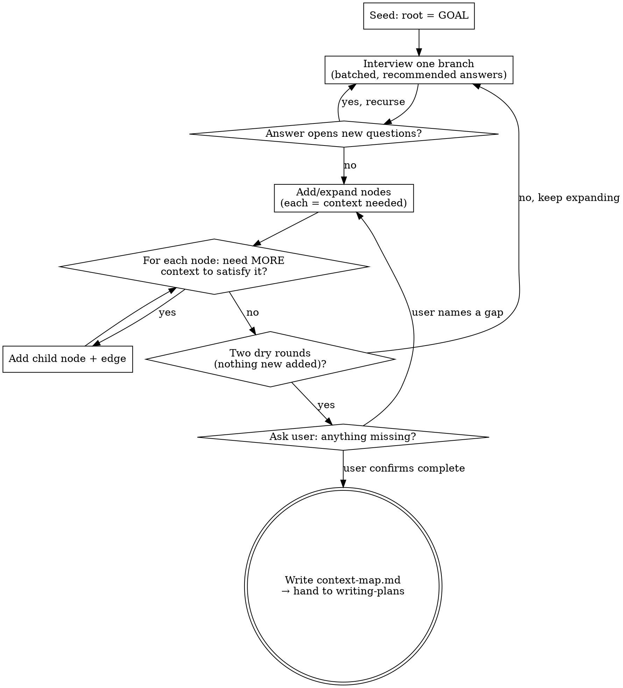
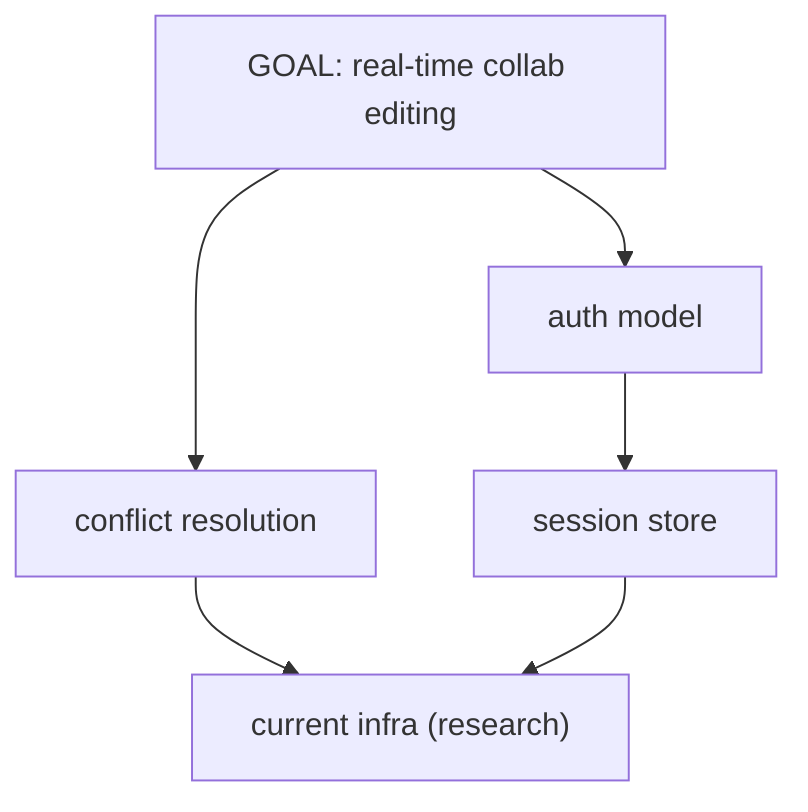

# Discovering Context

## Overview

Before you can write a good plan, you must know **what you need to know**. This
skill builds a **context dependency graph** — a DAG rooted at the goal whose
nodes are the pieces of context required to plan it, and whose edges are "B is
needed to satisfy A". You interview the user to resolve decisions, add a node
for each piece of context the goal depends on, then ask of **every node**:
*"do I need more context to satisfy this?"* — expanding leaves until the graph
saturates. The converged map is the input to `writing-plans`.

**Core principle:** A plan is only as good as the context behind it. Discover
and structure the context *first*, as a graph, so planning starts from a
complete picture instead of guesses.

**This is the upstream phase.** It composes into the existing flow:

```
discovering-context  →  writing-plans  →  executing-plans
   (this skill)          (the plan)        (the work)
```

**Announce at start:** "I'm using the discovering-context skill to map the
context this goal depends on before we plan it."

## When to Use

- The goal is large, ambiguous, or touches systems/decisions you don't yet understand
- You catch yourself about to plan on assumptions ("I'll just assume they use JWT…")
- Requirements exist but the *unknowns* haven't been enumerated
- Before `writing-plans` on anything non-trivial

**When NOT to use:** a small, fully-understood change with no open decisions —
go straight to `writing-plans`. This is context-cartography, not design
dialogue: for settling *what to build*, that is `brainstorming`; this skill
maps *what you must know* to build it. Run them together on big work
(brainstorm the design, discover the context) — they are complementary, not
duplicates.

## The Loop



### 1. Seed
Capture the goal verbatim as the root node `GOAL`. Take a **light** look at the
obvious entry points (README, top-level layout) so the interview isn't blind —
don't spelunk the whole codebase; unknowns become `needs-research` nodes to
resolve later, not exploration to do now.

### 2. Interview relentlessly — batched, one branch at a time
Walk down **one branch of the dependency tree at a time**, resolving decisions
before moving on. Ask with the **AskUserQuestion** tool so the user gets
selection boxes:

- **Every question carries your recommended answer as option 1**, labeled
  `(Recommended)`, with a one-line reason in its description.
- Batch the questions that belong to the *same branch* into one call (up to 4).
- **If an answer opens new questions, recurse** — ask the follow-ups before
  leaving the branch. Keep going until that branch is fully understood, then
  move to the next. Relentless means: no open decision left implicit.
- Open-ended questions with no discrete options → ask in prose, still with a
  recommended answer. (Hybrid is fine; prefer the boxes.)

Never plan on an unstated assumption. If you would have to assume it, it is a
node.

### 3. Build & expand the graph
Each resolved-or-open piece of context becomes a **node**. Draw an **edge
`A → B`** when B is context required to satisfy A. Then apply the recursion that
makes this a graph and not a checklist:

> For **every** node ask: *"Do I have enough to plan this, or does satisfying
> it depend on context I haven't captured yet?"* If more is needed, add a
> **child node + edge** and repeat on the child.

Example: `GOAL → auth` → satisfying `auth` needs `session-store` → which needs
`current-infra` (research node) and `data-retention-policy` (user-input node).
Keep descending each branch until its leaves pass the **leaf test**.

**The leaf test — a node may stop expanding ONLY when it is one of:**
- **(a) a decision** with a small enumerable option set AND your recommended default,
- **(b) a fact** answerable by reading specific code/docs/config (name the source), or
- **(c) a requirement** with a concrete, **measurable target value** (a number, not "fast" — "p95 remote apply < 250ms").

A question with no answer path is **not** a leaf. Expand **every branch to the
same standard** — the failure mode is descending deep on the interesting branch
(the core algorithm) and leaving the tedious ones (security, migration, ops,
a11y) one level shallow. If a branch feels boring, that is not permission to
stop early.

### 4. Saturate, then confirm
Keep looping steps 2–3 until **two consecutive rounds add no new nodes**
(auto-saturation — the graph has stopped growing). Saturation is not "the shape
looks done" — before you claim it, **verify node-by-node that every frontier
node passes the leaf test**. A `needs-input` question with no recommended answer,
or a requirement with no measurable value, is an open node, not a leaf, and the
map is not saturated. *Then* present the rendered map inline (see Output
Artifact) and ask explicitly: **"Is anything missing?"** Only when the user
confirms — after verified saturation — is the map complete. A gap they name
reopens the loop.

**When live interview isn't possible** (a headless/one-shot run, or the user
just wants the map in a single pass): don't block waiting for answers. Produce
the *complete* map anyway — carry each open decision as a `needs-input` node
with your recommended answer, mark facts you can't fetch as `needs-research`,
and close with "Is anything missing?" so the user can still redirect. The graph
must be fully rendered regardless.

## Node Schema

Every node records four things:

| Field | Meaning |
|-------|---------|
| **what** | The piece of context, named as a short slug (`session-store`) |
| **why** | Why the goal/parent depends on it — the edge, in words |
| **status** | `known` · `needs-input` (ask user) · `needs-research` (read files/docs/web) · `blocked` (waits on another node) · `resolved` |
| **how-to-fill** | The concrete next action that resolves it (question to ask, file to read, decision to make) |

## Output Artifact

**Always render the full map — the mermaid DAG *and* the node table — inline in
your response.** The graph is the deliverable; never reduce the response to a
prose summary that only *describes* the map or points at a saved file. Lead with
the rendered DAG so the reader sees the actual nodes and edges first. **In a
working session with a project, also save** the same content to
`plans/development/<goal-slug>-context-map.md` and give the path. In a one-shot
or headless run — or when there's no project to save into — skip the file and
just render inline; the response must stand on its own either way.

The artifact — inline and in the file — is a mermaid DAG plus the node table:

````markdown
# <Goal> — Context Map

**Goal:** <one sentence>
**Status:** saturated (2 dry rounds) · user-confirmed <date>



| node | why (edge) | status | how-to-fill |
|------|------------|--------|-------------|
| auth | collab needs per-user identity on each edit | resolved | JWT, confirmed w/ user |
| crdt | concurrent edits must merge without loss | needs-input | choose CRDT vs OT |
| session | auth tokens must persist across reconnects | needs-research | read `src/session/*` |
| infra | store + transport constrained by what we run | needs-research | check deploy config |
````

Hand the saved path to `writing-plans` as its input.

## Common Mistakes

| Mistake | Fix |
|---------|-----|
| Summary instead of the graph | Render the full mermaid DAG + node table inline. A prose recap that only *describes* the map, or points at a saved file, is not the deliverable. |
| Flat checklist, no edges | Every node states *why its parent needs it* — that's the edge. No edge ⇒ not a node. |
| Stopping at one level | Recurse: ask of each node whether it needs more context. Leaves must pass the leaf test. |
| Uneven recursion — deep on the fun branch, shallow on the boring one | Every branch descends to the SAME standard. Security/migration/ops/a11y get the same depth as the core algorithm. |
| Guessing instead of asking | If you'd assume it, make it a `needs-input` node and interview. |
| Questions without recommendations | Every question ships your recommended answer as option 1. |
| Requirement left as a vague word ("fast", "scalable") | Not a leaf until it has a measurable target value — a number. |
| Declaring "done" by shape, not by check | Saturation = you verified every frontier node passes the leaf test. Then two dry rounds AND user confirmation. |
| Rebuilding brainstorming | This maps *what you must know*, not *what to build*. Design decisions still route through `brainstorming`/`writing-plans`. |

## Composition

- **REQUIRED NEXT SKILL:** hand the converged map to `writing-plans` to produce the implementation plan.
- Complements `brainstorming` (design dialogue) — run alongside on large work; don't duplicate it.
- The saved artifact lives beside plans in `plans/development/` per repo convention.
